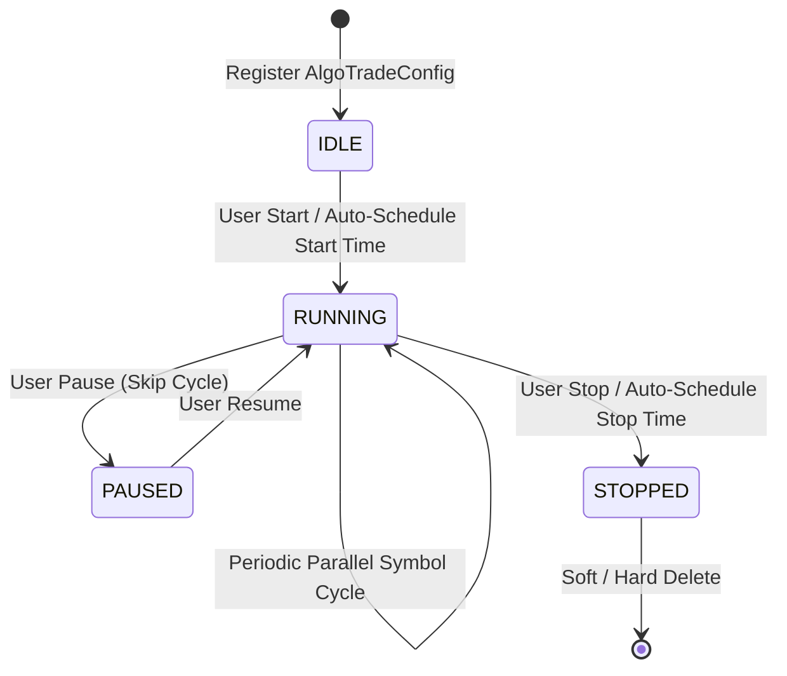
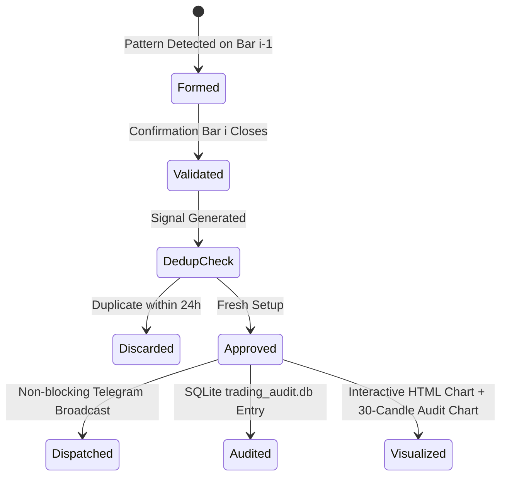

# TxBot Master Code Index (`CODE_INDEX.md`)

> **Project**: TxBot Universal Quantitative & Price Action Trading Platform  
> **Index Suffix**: `ROOT` / `MASTER`  
> **Workspace Root**: `e:\Txbot`  
> **Architecture Standard**: Market-Agnostic 10-Stage Universal Pipeline  
> **Last Updated**: 2026-09-27

---

## 1. Master Code Index Navigation Catalog

This master code index serves as the centralized map of the entire codebase for developers and AI agents. Use the table below to navigate directly to specialized code indexes for each layer, module, and service:

| Layer / Scope | Specialized Code Index | Location | Responsibilities & Summary |
|---|---|---|---|
| **Root Master** | [`CODE_INDEX.md`](file:///e:/Txbot/CODE_INDEX.md) | Root | System architecture, master workflow, execution instructions, token optimization guide. |
| **Backend Core** | [`CODE_INDEX_TXCORE.md`](file:///e:/Txbot/txcore/CODE_INDEX_TXCORE.md) | [`txcore/`](file:///e:/Txbot/txcore) | Complete backend quantitative engine, high-concurrency design, and module directory. |
| **Services Layer** | [`CODE_INDEX_SERVICES.md`](file:///e:/Txbot/txcore/CODE_INDEX_SERVICES.md) | [`txcore/`](file:///e:/Txbot/txcore) | FastAPI REST API endpoints, background auto-scheduler, and system telemetry. |
| **Pipeline & Engine** | [`CODE_INDEX_ALGOTRADE.md`](file:///e:/Txbot/txcore/CODE_INDEX_ALGOTRADE.md) | [`txcore/`](file:///e:/Txbot/txcore) | The 10-stage universal execution engine (`AlgoTrade`) and manager (`AlgoTradeManager`). |
| **Backend: Models** | [`CODE_INDEX_MODELS.md`](file:///e:/Txbot/txcore/models/CODE_INDEX_MODELS.md) | [`txcore/models/`](file:///e:/Txbot/txcore/models) | Frozen `Candle`, `Signal`, `Direction`, `VixRegime`, `generate_signal_id` contracts. |
| **Backend: Analysis** | [`CODE_INDEX_ANALYSIS.md`](file:///e:/Txbot/txcore/analysis/CODE_INDEX_ANALYSIS.md) | [`txcore/analysis/`](file:///e:/Txbot/txcore/analysis) | Candlestick anatomy, pattern algorithms, dynamic S/R levels, indicators, VIX analysis. |
| **Backend: MarketView** | [`CODE_INDEX_MARKETVIEW.md`](file:///e:/Txbot/txcore/marketview/CODE_INDEX_MARKETVIEW.md) | [`txcore/marketview/`](file:///e:/Txbot/txcore/marketview) | Unified data provider layer, market session manager, technical overlays, and O(1) incremental computation engine. |
| **Backend: Providers** | [`CODE_INDEX_PROVIDERS.md`](file:///e:/Txbot/txcore/providers/CODE_INDEX_PROVIDERS.md) | [`txcore/providers/`](file:///e:/Txbot/txcore/providers) | Data provider contracts, TTL cache, `TradingViewProvider`, `NSEClient`, `SessionManager`. |
| **Backend: Strategies** | [`CODE_INDEX_STRATEGIES.md`](file:///e:/Txbot/txcore/strategies/CODE_INDEX_STRATEGIES.md) | [`txcore/strategies/`](file:///e:/Txbot/txcore/strategies) | `PDFPriceActionStrategy` (6 setups), entry validation, `StrategyEvaluator` backtester. |
| **Backend: Visualization** | [`CODE_INDEX_VISUALIZATION.md`](file:///e:/Txbot/txcore/visualization/CODE_INDEX_VISUALIZATION.md) | [`txcore/visualization/`](file:///e:/Txbot/txcore/visualization) | TradingView Lightweight Charts (v4.2.1) standalone HTML generator, +30 candle audit charts. |
| **Backend: Audit** | [`CODE_INDEX_AUDIT.md`](file:///e:/Txbot/txcore/audit/CODE_INDEX_AUDIT.md) | [`txcore/audit/`](file:///e:/Txbot/txcore/audit) | `SignalDeduplicator` (24h prune), `TradeAuditor` (snapshots, MTF/news filter blocks, Prisma audit persistence). |
| **Backend: Execution** | [`CODE_INDEX_EXECUTION.md`](file:///e:/Txbot/txcore/execution/CODE_INDEX_EXECUTION.md) | [`txcore/execution/`](file:///e:/Txbot/txcore/execution) | `BrokerManager` (universal broker routing: `PaperBrokerAdapter`, `ZerodhaKiteBrokerAdapter`, `InteractiveBrokersAdapter`), `PaperTradingEngine` (simulated execution & dynamic trailing stops), `DiscordNotifier`, `WebhookNotifier`, `TelegramNotifier`. |
| **Backend: Filters** | [`CODE_INDEX_FILTERS.md`](file:///e:/Txbot/txcore/filters/CODE_INDEX_FILTERS.md) | [`txcore/filters/`](file:///e:/Txbot/txcore/filters) | `RiskManager` (institutional account risk guard, daily drawdown circuit breaker, consecutive loss streak limiter, emergency liquidation kill-switch), `FinnhubNewsFilter` macroeconomic keyword event guard. |
| **Backend: Config** | [`CODE_INDEX_CONFIG.md`](file:///e:/Txbot/config/CODE_INDEX_CONFIG.md) | [`config/`](file:///e:/Txbot/config) | Environment variables, credentials, Indian market timings, watchlists. |
| **Database & Persistence** | [`txcore/database.py`](file:///e:/Txbot/txcore/database.py) & [`txcore/persistence.py`](file:///e:/Txbot/txcore/persistence.py) | Dedicated thread-safe Prisma ORM worker, database hydration, AlgoTrade persistence, and deep audit storage. |
| **Frontend App** | [`CODE_INDEX_FRONTEND.md`](file:///e:/Txbot/frontend/CODE_INDEX_FRONTEND.md) | [`frontend/`](file:///e:/Txbot/frontend) | React 19 + Vite 8 SPA application architecture, API client (`api.js`), multi-theme tokens (Obsidian vs Enterprise). |
| **Frontend Components** | [`CODE_INDEX_COMPONENTS.md`](file:///e:/Txbot/frontend/src/components/CODE_INDEX_COMPONENTS.md) | [`frontend/src/components/`](file:///e:/Txbot/frontend/src/components) | UI components: `DashboardView`, `AlgoTradeView`, `MarketCatalogSelector`, `MarketDataView`, `AuditingView`, `PaperTradingView`, `LoggingView`, `ThemeSettingsModal`. |

---

## 2. Platform Architecture & Core Tenets

TxBot is designed from the ground up to solve automated algorithmic trading with zero market-specific coupling.

```mermaid
graph TB
    subgraph Frontend [Presentation Layer (React 19 + Vite)]
        UI[Command Center SPA] --> ApiClient[api.js]
    end

    subgraph ServiceLayer [Service Layer (FastAPI :8000)]
        FastAPI[FastAPI Server] --> Mgr[AlgoTradeManager]
        Scheduler[_scheduler_worker] --> Mgr
        FastAPI --> StaticMounts["/charts & /exports"]
    end

    subgraph Engine [AlgoTrade Execution Engine]
        Mgr --> AT1[AlgoTrade: 'Ishaq Strategy 1']
        Mgr --> AT2[AlgoTrade: 'Nifty Scalper']
        Mgr --> AT3[AlgoTrade: 'Forex Scanner']
    end

    subgraph Pipeline [10-Stage Universal Pipeline]
        S1[1. Select] --> S2[2. Fetch]
        S2 --> S3[3. Identify]
        S3 --> S4[4. Detect]
        S4 --> S6[6. Analyze]
        S6 --> S7[7. Execute]
        S7 -.->|Async ThreadPool| S5[5. Visualization]
        S7 -.->|Async ThreadPool| S8[8. Audit]
        S7 -.->|Async ThreadPool| S9[9. Dispatch]
        S7 -.->|Async ThreadPool| S10[10. Logging]
    end

    ApiClient --> FastAPI
    AT1 & AT2 & AT3 --> Pipeline
```

### The 10 Pipeline Stages
1. **Select**: Timeframe, symbol basket, indicators, patterns, and risk parameters loaded into [`AlgoTradeConfig`](file:///e:/Txbot/txcore/CODE_INDEX_ALGOTRADE.md#21-enums--config-dataclass).
2. **Fetch**: Thread-safe TTL cached data ingestion via [`BaseDataProvider`](file:///e:/Txbot/txcore/providers/CODE_INDEX_PROVIDERS.md#31-basedataprovider-abc).
3. **Identify**: Async parallel extraction of candles, VIX, moving averages, VWAP, and indicators.
4. **Detect**: Parallel pattern recognition and single candle anatomy classification ([`txcore/analysis`](file:///e:/Txbot/txcore/analysis/CODE_INDEX_ANALYSIS.md)).
5. **Visualization**: Background parallel thread-pool chart rendering producing interactive TradingView Lightweight Charts HTML ([`txcore/visualization`](file:///e:/Txbot/txcore/visualization/CODE_INDEX_VISUALIZATION.md)).
6. **Analyze**: Multi-factor trend, Multi-Timeframe Confirmation (MTF macro alignment), volatility regime, and support/resistance validation.
7. **Execute**: Strategy rulebook evaluation producing approved [`Signal`](file:///e:/Txbot/txcore/models/CODE_INDEX_MODELS.md#signal-actionable-trade-alert) with dynamic volatility-based Average True Range (ATR) stop loss and target levels.
8. **Audit**: Deduplication ([`SignalDeduplicator`](file:///e:/Txbot/txcore/audit/CODE_INDEX_AUDIT.md)), cycle telemetry, SQLite delivery logging, +30 candle audit verification charts.
9. **Dispatch**: Non-blocking asynchronous dispatch to Telegram channels and webhooks ([`txcore/execution`](file:///e:/Txbot/txcore/execution/CODE_INDEX_EXECUTION.md)).
10. **Logging**: Footprints appended to `signals_history.log` and `tv_market_data.log`.

---

## 3. High-Concurrency & Performance Guarantees

1. **Computation Saving**:
   - In-memory thread-safe TTL caching (`get_cached_candles`) eliminates duplicate network fetches when multiple strategies monitor overlapping symbols.
   - Vectorized rolling indicators (`calculate_ema`, `calculate_rsi`) computed in bulk.
2. **Hybrid Real-Time Tick Synthesis**:
   - `RealTimeTickSynthesizer` combines deep TradingView historical lookback bars with live spot quotes from `NSEClient.get_stock_quote` so the active forming candle (`index -1`) never lags by 15 minutes or omits recent price action.
3. **Non-Blocking Concurrency & Telemetry Transparency**:
   - Signal discovery is prioritized: when a signal is approved, chart rendering, database writing, Telegram API requests, and log writes are submitted to `ThreadPoolExecutor` workers.
   - Transparent telemetry: Active worker threads, queue depth, and per-symbol scan latencies tracked on each `AlgoTrade` and streamed via `/api/stream` (SSE) and `/api/concurrency`.
   - Real-time Server-Sent Events (SSE) broadcast cycle updates and signal alerts directly to connected frontend clients, eliminating polling delay.
4. **Collision-Resistant Unique Identifiers**:
   - Signals: `SIG-{PAIR}-{YYYYMMDD-HHMMSS}-{HEX6}` (e.g. `SIG-RELIANCE-20260927-091500-A9F3D2`).
   - Strategies: `AT-{NAME}-{YYYYMMDD}-{HEX6}` (e.g. `AT-NiftyScalper-20260927-1234AB`).

---

## 4. Master Workflow & Life Cycles

### 4.1 AlgoTrade Process Lifecycle


### 4.2 Signal Execution & Audit Lifecycle


---

## 5. Quick-Start Execution Guide

### 5.1 Launch Backend & Frontend Services
```powershell
# 1. Start FastAPI Backend Service (Serves REST API + Embedded UI)
python run_server.py
# Server running on http://127.0.0.1:8000

# 2. (Optional) Run Frontend Vite Dev Server
cd frontend
npm run dev
# Frontend running on http://localhost:5173 (Proxied to :8000)
```

### 5.2 Standalone Testing & Verification
```powershell
# Run Telegram dispatch verification with chart attachment
python test_telegram.py

# Run standalone chart generation CLI
python -m txcore.visualization.chart_cli --symbol RELIANCE --timeframe 5m

# Run headless terminal AlgoTrade continuous scan daemon
python run_algotrade.py
```

### 5.3 Automated Test Suite
```powershell
pytest -v
```

---

## 6. AI Agent Memory & Token Optimization Guidelines

When interacting with this codebase in future agent tasks:

1. **Consult Code Indexes First**: Never scan whole directories or large source files (`chart_builder.py`, `service.py`, `algotrade.py`) blindly. Look up signatures and contracts in the relevant `CODE_INDEX_<NAME>.md` file first.
2. **Token Savings**: Consulting the index saves ~85% of tokens compared to reading raw source files.
3. **Updating Rule**: Whenever a module's public methods, endpoints, classes, or architecture changes:
   - Update that module's `CODE_INDEX_<NAME>.md`.
   - Update this master `CODE_INDEX.md` and repository indexes if top-level workflows change.
