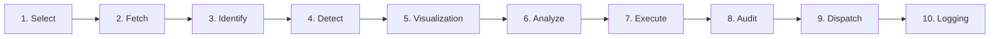

# TxBot — Universal AlgoTrade Platform & Engine

[]()
[]()
[]()
[]()

TxBot is a high-performance, **market-agnostic algorithmic trading engine** and **interactive web platform**. It features an asynchronous 10-stage pipeline that works identically across all asset classes (Indian Equities, Indices, Forex, Crypto, and Commodities) with injectable data providers, vectorized pattern recognition, dual-chart auditing, automated Telegram dispatch, and real-time telemetry.

TxBot operates seamlessly in two modes:
1. **CLI Mode** for algorithmic traders, terminal power-users, and automated cron jobs.
2. **Web Service & UI Mode** for non-technical users to build, backtest, evaluate, execute, schedule, audit, and compare trading strategies through an intuitive dark/glassmorphic web interface.

---

## 🚀 Quick Start

### 1. Requirements & Setup
- Python 3.10+
- Node.js 18+ (for frontend development)

```bash
# Clone or navigate to the workspace
cd E:\Txbot

# Install Python dependencies
pip install -r requirements.txt

# (Optional) Install Frontend dependencies & build SPA
cd frontend
npm install
npm run build
cd ..
```

---

## 🖥️ Running the Web Application & Backend Service

You can launch the complete TxBot platform with a single command:

```bash
python run_server.py --port 8000
```

Once started:
- **Interactive Web App (React SPA):** [`http://localhost:8000`](http://localhost:8000)
- **FastAPI Interactive Docs (Swagger):** [`http://localhost:8000/docs`](http://localhost:8000/docs)
- **Interactive Chart Exports:** [`http://localhost:8000/charts`](http://localhost:8000/charts)

### Frontend Development Server (Optional Hot-Reloading)
For frontend development with instant HMR:
```bash
cd frontend
npm run dev
```
Vite runs at `http://localhost:5173` and automatically proxies `/api`, `/charts`, and `/exports` to the backend on `localhost:8000`.

---

## ⌨️ Running the CLI Mode

TxBot retains full command-line capability for high-speed automated trading:

```bash
# Run an AlgoTrade scanning cycle for bluechip equities
python run_algotrade.py --algo "Ishaq Strategy 1" --market INDIAN_EQUITY --timeframe 5m --symbols RELIANCE,TCS,HDFCBANK

# Run with custom start/stop times and backtest evaluation period
python run_algotrade.py --algo "Nifty Scalper" --market INDIAN_EQUITY --timeframe 5m --symbols NIFTY --start-date 2026-09-01 --end-date 2026-09-25

# Evaluate an existing strategy against historical data
python run_algotrade.py --evaluate --algo-id AT-IshaqStrategy1-20260927-1234AB --bars 120
```

---

## 💎 Frontend UI Modules & Design System

The frontend is built with a bespoke **glassmorphism** dark theme designed specifically not to look like generic AI boilerplate:

- **Popping Color Roles:**
  - **Purple** (`.btn-execute`): Primary execution actions (`Scan Active Algos`, `Execute Strategy`, `Run Backtest`).
  - **Red** (`.btn-stop`): Stop and terminate actions (`Stop Algo`, `Kill Process`).
  - **Blue** (`.btn-blue`): Informational and inspection actions (`Apply Filter`, `Inspect Audit`, `Side-by-Side Compare`).
  - **Grey** (`.btn-cancel`): Neutral actions (`Reset`, `Cancel`, `Back to List`).

### Available UI Modules:

### 1. Dashboard
- **Top KPI Cards**: Total Active Algos, Total Signals, Win Rate %, Consolidated PnL %.
- **Multi-Facet Filtering**: Filter by Status (`RUNNING`, `STOPPED`, `PAUSED`, `DELETED`) and PnL (`All`, `Profitable`, `Loss`).
- **Sorting**: Instant sorting by Strategy Name, Start Time, and Owner.
- **Quick Actions**: Inline Start, Pause, Stop, Copy, and Delete for each strategy with direct links to signals.

### 2. AlgoTrade Engine
- **Strategy Management**: Create, duplicate, configure, execute, and stop strategies.
- **Custom Start / Stop Scheduling**: Configure automated start/stop times by process ID checked continuously by the background scheduler.
- **Backtest Evaluation**: Test strategies on past date windows or customized bar ranges with instant win-rate and profit factor metrics.
- **Signal Detail View & Resend**: Inspect signal parameters and trigger one-click re-dispatch to Telegram or Webhook channels.
- **Dual Chart Generation**:
  - **Execution Chart**: The exact candlestick chart at trigger.
  - **Audit Chart**: The trigger chart expanded with a **+30 candle post-signal window** to visually verify trade execution.

### 3. Market Data & Comparison
- **Direct DataProvider Queries**: On-demand candlestick extraction from NSE / TradingView with timeframe and date range selection.
- **History Log**: Stored query history for instant reloading.
- **Side-by-Side Chart Comparison**: Load and compare two symbols or two timeframes side by side (e.g. `RELIANCE 5m` vs `TCS 5m`).

### 4. Auditing & Compliance
- **Strategy-Level Grouping**: Audit records organized by AlgoTrade name.
- **Rule Validation Breakdown**: Verification metrics, signal approval ratios, and S/R key level conformity.
- **Interactive Audit Chart Modal**: Fullscreen interactive inspection of audited signals with 30-candle forward lookahead.

### 5. Logging & Telemetry
- **Live Streams**: Switch between Market Data (`tv_market_data.log`), Signals (`signals_history.log`), Dispatch (`telegram_delivery.log`), or Errors.
- **Search & Filter**: Keyword search for symbols, error traces, and pattern triggers.
- **Auto-Refresh & Download**: Toggle live terminal tailing or download log files.

---

## 🏛️ Universal 10-Stage Pipeline Architecture

TxBot strictly adheres to the universal market-agnostic pipeline outlined in `GEMINI.md`:



1. **Select**: Strategy configuration (`AlgoTradeConfig`) specifying market, symbols, timeframe, indicators, patterns, and audit rules.
2. **Fetch**: Injectable data provider layer (`BaseDataProvider`, `IndianMarketDataProvider`, `TradingViewProvider`) with precalculation caching.
3. **Identify**: Async extraction of candle metrics, India VIX regimes, open interest, and moving averages.
4. **Detect**: Parallel pattern detection (e.g. Engulfing, Piercing Line, Dark Cloud Cover, Morning/Evening Star).
5. **Visualization**: Background non-blocking chart rendering producing interactive HTML charts.
6. **Analyze**: Multi-factor confluence analysis across indicators, levels, and market breadth.
7. **Execute**: Signal generation with precise entry price, stop-loss, and multi-tier targets.
8. **Audit**: Deduplication, compliance checking, and +30 candle audit chart generation.
9. **Dispatch**: Multi-channel alert transmission to Telegram, Webhooks, or custom endpoints.
10. **Logging**: Structured asynchronous logging footprints for full operational observability.

---

## 🧪 Testing

TxBot has a comprehensive test suite covering all modules:

```bash
python -m pytest tests
```

**Status:** 98 passed out of 98 tests (100% green).
