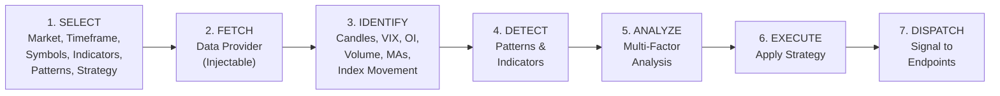
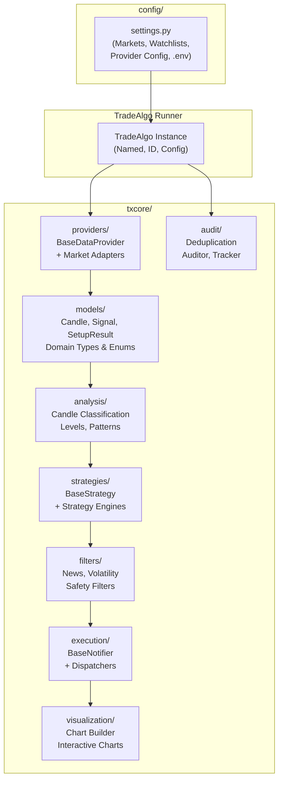
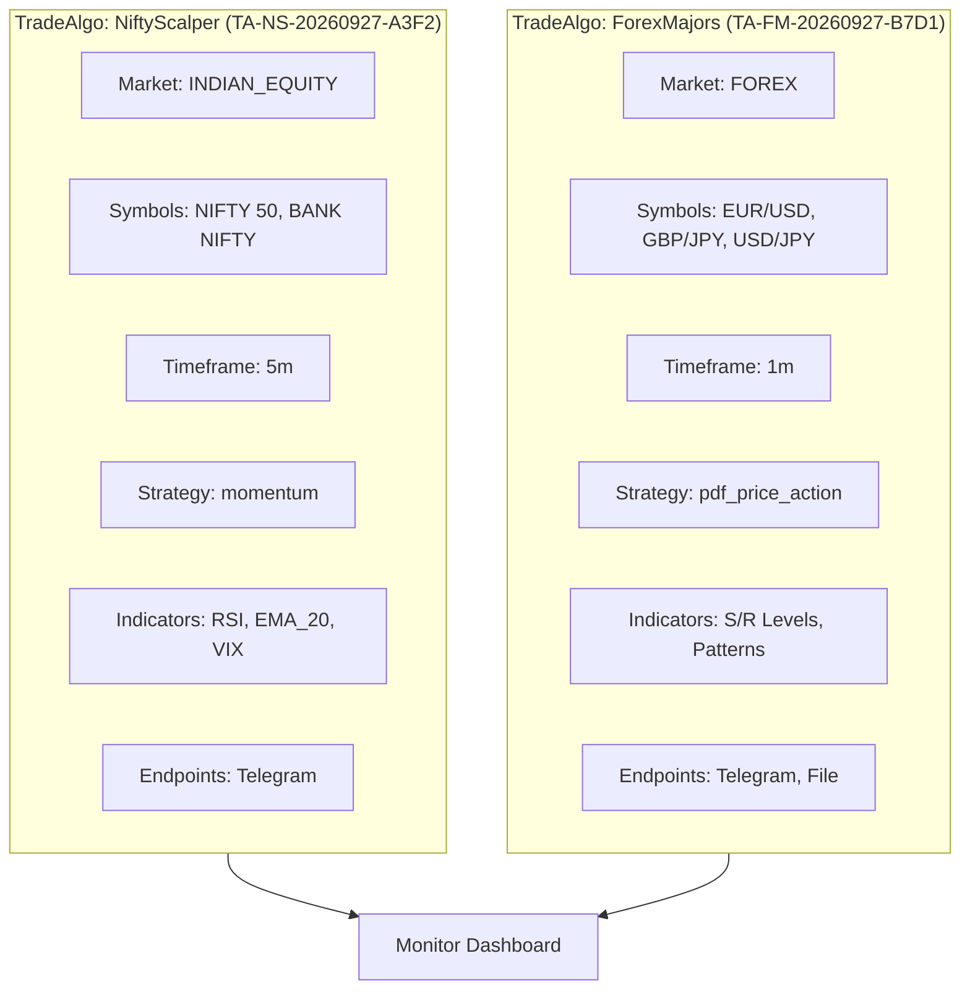

# TxBot Trading Engine V2 — Requirements Document

> **Version**: 2.0-DRAFT  
> **Date**: 2026-09-27  
> **Status**: Requirements Gathering  
> **Author**: TxBot Development Team

---

## 1. Executive Summary

TxBot is a modular, multi-market trading signal engine that automates the full pipeline from market data ingestion through pattern detection, multi-factor analysis, strategy execution, and signal dispatch. The V2 architecture replaces the current market-specific folder approach with a **universal, market-agnostic pipeline** where all markets (Forex, Indian Equities, Commodities, Crypto) share identical module structure and data flow.

Each running pipeline instance is a **TradeAlgo** — a named, identifiable, independently monitorable process that encapsulates a complete configuration from market selection through signal delivery.

---

## 2. System Architecture

### 2.1 High-Level Pipeline Flow



### 2.2 Module Architecture



### 2.3 Core Design Principles

| Principle | Description |
|-----------|-------------|
| **Market-Agnostic** | No market-specific folders. Same pipeline for Forex, Indian, Commodity, Crypto. |
| **Provider Injection** | Data providers are interchangeable adapters behind `BaseDataProvider`. |
| **Configuration-Driven** | Market, symbols, timeframe, strategy, indicators — all configurable per TradeAlgo. |
| **Modular Pipeline** | Each step is a standalone, testable module. Steps can be composed freely. |
| **Process Model** | Each pipeline run = TradeAlgo instance with unique name & ID. |
| **Market Nomenclature** | Code uses trading terms (candle, bar, signal, level), not generic CS abstractions. |

---

## 3. Pipeline Stages — Detailed Requirements

### 3.1 Stage 1: SELECT (Configuration)

The user or system defines a **TradeAlgo configuration** specifying:

| Setting | Type | Example Values | Required |
|---------|------|---------------|----------|
| `market` | Enum | `FOREX`, `INDIAN_EQUITY`, `COMMODITY`, `CRYPTO` | ✅ |
| `timeframe` | String | `1m`, `5m`, `15m`, `1h`, `4h`, `1d`, `live` | ✅ |
| `symbols` | List[str] | `["RELIANCE", "TCS"]`, `["EUR/USD", "GBP/JPY"]` | ✅ |
| `indices` | List[str] | `["NIFTY 50", "BANK NIFTY"]`, `["DXY"]` | ❌ |
| `data_provider` | String | `tradingview`, `nse`, `zerodha`, `angel_one` | ✅ |
| `indicators` | List[str] | `["RSI", "EMA_20", "EMA_50", "MACD", "VWAP"]` | ❌ |
| `patterns` | List[str] | `["bullish_engulfing", "dark_cloud_cover"]` | ❌ |
| `strategy` | String | `pdf_price_action`, `mean_reversion`, `momentum` | ✅ |
| `extra_data` | List[str] | `["volume", "vix", "oi_table", "index_movement"]` | ❌ |
| `chart_enabled` | Bool | `true` / `false` | ❌ |
| `chart_type` | String | `tradingview`, `plotly`, `lightweight` | ❌ |
| `signal_endpoints` | List[Dict] | `[{"type": "telegram", "chat_ids": [...]}]` | ✅ |
| `algo_name` | String | `"TradeAlgo1"`, `"NiftyScalper"` | ✅ |
| `algo_id` | String (auto) | UUID or `TA-{name}-{timestamp}-{hex}` | Auto |

> [!IMPORTANT]
> The SELECT stage must support both **CLI arguments** and **programmatic config objects** (Python dict / YAML / JSON) so TradeAlgos can be spun up from the API, CLI, or future React UI.

### 3.2 Stage 2: FETCH (Data Provider Layer)

**Interface**: `BaseDataProvider` (existing in [`txcore/providers/base.py`](file:///E:/Txbot/txcore/providers/base.py))

```python
class BaseDataProvider(ABC):
    @abstractmethod
    def get_candles(self, symbol, timeframe, lookback_bars, **kwargs) -> Optional[pd.DataFrame]:
        """Returns DataFrame with columns: ['time', 'open', 'high', 'low', 'close', 'volume']"""
        pass
```

**Supported providers** (current + planned):

| Provider | Market(s) | Module | Status |
|----------|-----------|--------|--------|
| TradingView (tvDatafeed) | Forex, Indian, Commodity, Crypto | `tradingview.py` | ✅ Existing |
| NSE India API | Indian Indices, Breadth, VIX | `nse_provider.py` | ✅ Built (needs refactor from `indian_market/`) |
| Zerodha Kite | Indian F&O, Equities | `zerodha_provider.py` | 🔲 Planned |
| Angel One | Indian Equities | `angel_one_provider.py` | 🔲 Planned |
| Dhan | Indian F&O | `dhan_provider.py` | 🔲 Planned |
| OANDA | Forex | `oanda_provider.py` | 🔲 Planned |
| Finnhub | Multi-market | `finnhub_provider.py` | 🔲 Planned |
| MT5 | Forex, CFDs | `mt5_provider.py` | 🔲 Planned |

**Key requirements**:
- All providers return the **same DataFrame schema** (`time`, `open`, `high`, `low`, `close`, `volume`).
- Provider selection is **configuration-driven** — injected at TradeAlgo creation.
- Multiple providers can be composed (e.g., TradingView for candles + NSE API for VIX/breadth).
- Each provider handles its own authentication, session management, and rate limiting internally.

### 3.3 Stage 3: IDENTIFY (Data Enrichment)

After raw OHLCV data is fetched, the pipeline enriches it with supplementary market data:

| Data Type | Description | Source(s) | Module |
|-----------|-------------|-----------|--------|
| **Candle Classification** | Doji, Hammer, Marubozu, Spinning Top, etc. | Computed from OHLCV | `txcore/analysis/candle.py` |
| **VIX** | Volatility Index (regime: LOW/NORMAL/ELEVATED/EXTREME) | NSE API, CBOE, TradingView | Provider + `analysis/` |
| **OI Table** | Open Interest by strike for F&O | NSE API, Zerodha | Provider |
| **Index Movement** | Benchmark index (NIFTY, S&P 500) delta & direction | Provider | Computed |
| **Volume Profile** | Volume at price levels, VWAP | Computed from OHLCV | `analysis/` |
| **Moving Averages** | EMA-20, EMA-50, SMA-200, etc. | Computed from OHLCV | `analysis/` |
| **RSI** | Relative Strength Index | Computed | `analysis/` |
| **MACD** | Moving Average Convergence Divergence | Computed | `analysis/` |
| **Bollinger Bands** | Price channels based on std dev | Computed | `analysis/` |
| **Support/Resistance** | Key price levels from swing highs/lows | Computed | `analysis/levels.py` |
| **ADR / Market Breadth** | Advance-Decline Ratio, sentiment | NSE API | Provider |

> [!NOTE]
> Which data types are computed depends on the TradeAlgo configuration (`indicators` and `extra_data` fields). Only requested data is computed to keep the pipeline efficient.

### 3.4 Stage 4: DETECT (Pattern & Indicator Recognition)

**Current patterns** (from [`txcore/analysis/patterns.py`](file:///E:/Txbot/txcore/analysis/patterns.py)):
- Bullish Engulfing, Bearish Engulfing
- Piercing Line, Dark Cloud Cover
- Morning Star, Evening Star
- Tweezer Bottom, Tweezer Top

**Planned additions**:
- Three White Soldiers / Three Black Crows
- Head & Shoulders / Inverse H&S
- Double Top / Double Bottom
- Flag / Pennant / Wedge
- Cup & Handle
- Inside Bar / Outside Bar

**Requirements**:
- Pattern detection functions are **pure functions** operating on DataFrames (no side effects).
- Only patterns specified in TradeAlgo config are scanned (configurable, not hardcoded).
- Each detected pattern returns a standardized `PatternResult` with: pattern type, direction, confidence, bar indices, metadata.

### 3.5 Stage 5: ANALYZE (Multi-Factor Analysis Engine)

The analysis engine combines outputs from Stages 3 and 4 into a unified assessment:

```
Analysis Input:
├── Candle classifications (last N bars)
├── Detected patterns
├── Indicator values (RSI, MACD, MAs, BBands)
├── VIX regime
├── Index movement direction & magnitude
├── Support/Resistance levels & proximity
├── Volume profile & VWAP
├── Market breadth (if available)
└── OI data (if available)

Analysis Output:
├── Overall bias (BULLISH / BEARISH / NEUTRAL)
├── Conviction score (0-100)
├── Contributing factors (ranked list)
├── Risk flags (if any)
└── Recommended action context
```

**Requirements**:
- The analysis is **configurable** — the TradeAlgo config specifies which factors to include.
- Each factor contributes a weighted score; weights are strategy-dependent.
- Analysis results are structured data (dataclass), not free-text.

### 3.6 Stage 6: EXECUTE (Strategy Application)

**Interface**: `BaseStrategy` (existing in [`txcore/strategies/base.py`](file:///E:/Txbot/txcore/strategies/base.py))

```python
class BaseStrategy(ABC):
    @abstractmethod
    def find_setup(self, df: pd.DataFrame) -> Optional[SetupResult]: ...
    @abstractmethod
    def validate_entry(self, df: pd.DataFrame, setup: SetupResult) -> bool: ...
    @abstractmethod
    def evaluate(self, df: pd.DataFrame, symbol: str) -> Optional[Signal]: ...
```

**Current strategies**:
- `PDFPriceActionStrategy` — Rule-based price action from BO Price Action Book

**Planned strategies**:
- `MomentumStrategy` — Trend-following with RSI/MACD confirmation
- `MeanReversionStrategy` — Bollinger Band / VWAP reversion
- `FnOMomentumStrategy` — Indian F&O specific with OI + VIX weighting
- `ScalpingStrategy` — High-frequency 1m/5m setups

**Requirements**:
- Strategy selection is configuration-driven.
- Strategies receive the enriched DataFrame (with indicators pre-computed).
- Strategies produce a `Signal` or `None`. No side effects.
- Safety filters (news, volatility circuit breakers) are applied **after** strategy evaluation but **before** dispatch.

### 3.7 Stage 7: DISPATCH (Signal Delivery)

**Interface**: `BaseNotifier` (existing in [`txcore/execution/base.py`](file:///E:/Txbot/txcore/execution/base.py))

```python
class BaseNotifier(ABC):
    @abstractmethod
    def send(self, message: str, signal: Optional[Signal] = None) -> bool: ...
```

**Supported channels** (current + planned):

| Channel | Module | Status |
|---------|--------|--------|
| Telegram | `telegram.py` | ✅ Existing |
| File Logger | `file_logger.py` | ✅ Existing |
| Discord | `discord.py` | 🔲 Planned |
| WhatsApp (Twilio) | `whatsapp.py` | 🔲 Planned |
| Email (SMTP) | `email.py` | 🔲 Planned |
| Webhook (Generic) | `webhook.py` | 🔲 Planned |
| Push Notification | `push.py` | 🔲 Planned |

**Requirements**:
- Multiple endpoints per TradeAlgo (e.g., Telegram + File + Discord simultaneously).
- Each signal includes: text alert, chart attachment (if enabled), metadata.
- Delivery tracking and retry logic via `audit/delivery_tracker.py`.

---

## 4. TradeAlgo Process Model

### 4.1 Concept

A **TradeAlgo** is a named, independently running pipeline instance:



### 4.2 TradeAlgo Properties

| Property | Type | Description |
|----------|------|-------------|
| `algo_name` | str | Human-readable name (e.g., "NiftyScalper") |
| `algo_id` | str | Unique ID (`TA-{name}-{date}-{hex6}`) |
| `status` | Enum | `RUNNING`, `PAUSED`, `STOPPED`, `ERROR` |
| `config` | Dict | Full pipeline configuration |
| `created_at` | datetime | Creation timestamp |
| `cycle_count` | int | Number of scan cycles completed |
| `signals_generated` | int | Total signals produced |
| `signals_dispatched` | int | Total signals successfully dispatched |
| `last_scan_at` | datetime | Timestamp of last scan cycle |
| `error_log` | List | Recent errors (capped) |

### 4.3 Multi-TradeAlgo Requirements

- Multiple TradeAlgo instances can run simultaneously.
- Each TradeAlgo is independently configurable, startable, stoppable, and monitorable.
- A **TradeAlgo Manager** orchestrates lifecycle (create, start, pause, stop, destroy).
- Status and metrics are queryable programmatically and via CLI.

---

## 5. Configuration Schema

### 5.1 TradeAlgo Configuration (YAML example)

```yaml
algo_name: "NiftyScalper"
market: "INDIAN_EQUITY"
timeframe: "5m"
symbols:
  - "NIFTY 50"
  - "BANK NIFTY"
  - "RELIANCE"
data_provider: "tradingview"
auxiliary_providers:           # Optional: additional data sources
  - provider: "nse"
    data: ["vix", "breadth", "oi_table"]
indicators:
  - "RSI"
  - "EMA_20"
  - "EMA_50"
  - "VWAP"
patterns:
  - "bullish_engulfing"
  - "bearish_engulfing"
  - "morning_star"
strategy: "momentum"
extra_data:
  - "vix"
  - "index_movement"
  - "volume"
chart:
  enabled: true
  type: "tradingview"
  auto_open: false
analysis:
  factors: ["vix", "index_movement", "indicators", "patterns", "candles"]
  weights:                     # Strategy-specific factor weights
    vix: 0.15
    index_movement: 0.20
    indicators: 0.30
    patterns: 0.25
    candles: 0.10
signal_endpoints:
  - type: "telegram"
    bot_token: "${TELEGRAM_BOT_TOKEN}"
    chat_ids: ["${CHAT_ID}"]
  - type: "file"
    path: "exports/signals/"
schedule:
  candle_sync: true
  scan_interval_seconds: 300
  pair_request_delay: 0.8
```

### 5.2 Global Configuration (`config/settings.py`)

Retains environment-based configuration with market-specific watchlists:

```python
# Market Watchlists (shared across all TradeAlgos)
FOREX_PAIRS: Dict[str, Dict[str, str]]           # EUR/USD, GBP/JPY, etc.
INDIAN_INDICES: Dict[str, Dict[str, str]]          # NIFTY, BANKNIFTY, etc.
INDIAN_STOCKS_WATCHLIST: Dict[str, Dict[str, str]] # RELIANCE, TCS, etc.
COMMODITY_SYMBOLS: Dict[str, Dict[str, str]]       # GOLD, SILVER, CRUDE, etc.
CRYPTO_PAIRS: Dict[str, Dict[str, str]]            # BTC/USD, ETH/USD, etc.
```

---

## 6. Non-Functional Requirements

| Category | Requirement |
|----------|-------------|
| **Testability** | Every module must have unit tests. Pure functions preferred. All tests runnable via `python -m pytest tests`. |
| **Extensibility** | Adding a new market = adding a provider + config. No structural changes needed. |
| **Maintainability** | Code uses market nomenclature. Module naming matches trading concepts. |
| **Performance** | Pipeline should complete one scan cycle across all symbols in < 30s. |
| **Resilience** | Provider failures must be caught and logged, not crash the TradeAlgo. |
| **Idempotency** | Signal deduplication prevents redundant alerts within configurable window. |
| **Observability** | Each TradeAlgo exposes status, cycle count, signal count, error log. |

---

## 7. Future Scope (Phase 2+)

### 7.1 Paper Trading

- Execute paper trades through online applications or self-hosted instances.
- Track simulated positions with entry/exit prices, P&L.
- Support multiple paper trading backends (custom, virtual broker APIs).

### 7.2 Performance Analytics

| Metric | Description |
|--------|-------------|
| **P&L Tracking** | Per-TradeAlgo profit/loss over time |
| **Accuracy Matrix** | Win rate, risk-reward ratio, per-pattern accuracy |
| **Score Cards** | Composite performance scores per strategy |
| **Audit Trail** | Complete signal lifecycle (generated → dispatched → trade result) |

### 7.3 Multi-User & Admin

- Multiple users with role-based access (Admin, Viewer, Operator).
- Admin can configure, start/stop, and audit any TradeAlgo.
- Per-user TradeAlgo ownership and visibility controls.

### 7.4 React UI

- **Sleek, seamless, easy-to-use** dashboard.
- Real-time TradeAlgo status monitoring.
- Interactive chart viewing (embedded TradingView Lightweight Charts).
- Configuration management (create/edit/delete TradeAlgo configs).
- Signal history and performance analytics visualization.
- Code must be **maintainable and in sync** with the Python backend.

### 7.5 Advanced Features

- **Multi-TradeAlgo Comparison**: Side-by-side performance of different strategies.
- **Backtesting Engine**: Historical data replay through the pipeline.
- **Alert Escalation**: Progressive notification urgency based on conviction score.
- **Market Session Awareness**: Auto-pause during market holidays/off-hours per market timezone.

---

## 8. Current State vs Target State

### 8.1 What Exists Today (V1)

| Component | Status | Notes |
|-----------|--------|-------|
| `BaseDataProvider` | ✅ | Abstract interface in `txcore/providers/base.py` |
| `TradingViewProvider` | ✅ | Forex + Indian via tvDatafeed |
| `IndianMarketDataProvider` | ✅ | NSE adapter (in `indian_provider.py`) |
| `indian_market/` package | ⚠️ **Needs refactor** | Violates market-agnostic rule — must be dissolved |
| `BaseStrategy` | ✅ | Abstract interface |
| `PDFPriceActionStrategy` | ✅ | Functional price action strategy |
| `BaseNotifier` | ✅ | Abstract interface |
| `TelegramNotifier` | ✅ | Functional Telegram dispatch |
| `analysis/` (candle, levels, patterns) | ✅ | Pure functions on DataFrames |
| `visualization/` (chart_builder) | ✅ | TradingView HTML charts |
| `audit/` (deduplicator, auditor) | ✅ | Signal dedup + SQLite audit |
| `filters/` (news_finnhub) | ✅ | Finnhub news safety filter |
| Main bot runner | ✅ | `pdf_price_action_bot_v3_tradingview.py` (Forex-focused) |
| 82 passing tests | ✅ | `python -m pytest tests` |

### 8.2 Refactoring Required

| Current | Target | Action |
|---------|--------|--------|
| `txcore/indian_market/` folder | Dissolve | Move reusable logic into existing market-agnostic modules |
| `indian_market/constants.py` | `config/settings.py` | Merge Indian constants into central config |
| `indian_market/models.py` | `txcore/models/types.py` | Merge Indian domain models into shared types |
| `indian_market/session.py` | `txcore/providers/` or `txcore/analysis/` | Market session logic becomes part of provider or a new shared `sessions/` module (for ALL markets) |
| `indian_market/nse_client.py` | `txcore/providers/nse_provider.py` | HTTP client becomes an internal detail of the NSE provider |
| `indian_market/extractor.py` | Dissolve across pipeline | Extraction logic distributed into providers + analysis + strategies |
| `indian_market/cli.py` | Unified CLI | Single CLI that works for any market |
| Hardcoded Forex-only runner | `TradeAlgo` runner | Configurable, market-agnostic runner |

---

## 9. Delivery Roadmap

### Phase 1: Architecture Refactor (Foundation)
- [ ] Create `GEMINI.md` architectural rule ✅
- [ ] Dissolve `txcore/indian_market/` into market-agnostic modules
- [ ] Create `TradeAlgo` config dataclass and manager
- [ ] Unify CLI to work with any market
- [ ] Merge Indian models into `txcore/models/types.py`
- [ ] Move NSE client into `txcore/providers/nse_provider.py`
- [ ] Create market session abstraction (for all markets)
- [ ] Update tests

### Phase 2: Indicator & Analysis Framework
- [ ] Build indicator computation module (`txcore/analysis/indicators.py`)
- [ ] Implement RSI, MACD, Bollinger Bands, VWAP
- [ ] Build multi-factor analysis engine
- [ ] Add configurable pattern selection
- [ ] Add more patterns (H&S, Double Top/Bottom, Flags)

### Phase 3: Multi-Strategy & Multi-Provider
- [ ] Implement Momentum Strategy
- [ ] Implement Mean Reversion Strategy
- [ ] Add Zerodha/Angel One providers
- [ ] Add Discord/WhatsApp/Email dispatchers
- [ ] Multi-TradeAlgo concurrent execution

### Phase 4: Paper Trading & Analytics
- [ ] Paper trading engine
- [ ] P&L tracking per TradeAlgo
- [ ] Accuracy matrix & scorecards
- [ ] Backtesting engine

### Phase 5: React UI & Multi-User
- [ ] React dashboard (real-time monitoring)
- [ ] TradeAlgo CRUD from UI
- [ ] User management & RBAC
- [ ] Interactive chart embedding
- [ ] Signal history & analytics views

---

## 10. Glossary

| Term | Definition |
|------|-----------|
| **TradeAlgo** | A named, identifiable pipeline instance with full configuration |
| **Provider** | A data source adapter that fetches OHLCV data from a market |
| **Strategy** | A decision engine that evaluates enriched data and produces signals |
| **Signal** | An actionable trading alert with direction, price, pattern, and metadata |
| **Candle** | A single OHLCV bar representing price action over a timeframe |
| **Pipeline** | The 7-stage flow: Select → Fetch → Identify → Detect → Analyze → Execute → Dispatch |
| **Dispatch** | Sending a signal to one or more configured endpoints |
| **Market Breadth** | Advance-Decline Ratio indicating overall market sentiment |
| **VIX** | Volatility Index measuring expected market volatility |
| **OI** | Open Interest — total outstanding derivative contracts |
