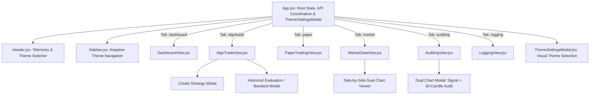

# TxBot Code Index: Frontend Components (`frontend/src/components`)

> **Index Identifier**: `frontend/src/components`  
> **Index Suffix**: `COMPONENTS`  
> **Source Directory**: [`frontend/src/components/`](file:///e:/Txbot/frontend/src/components)  
> **Role**: React UI presentation components, strategy controllers, theme switcher, chart visualizers, audit tables, and live telemetry dashboards.

---

## 1. Components Overview & Architecture

The frontend components implement an intuitive, dual-themed command center for non-technical traders and quantitative developers alike. Built using **React + Vite + Tailwind/Modern CSS + Lucide Icons**, every component communicates with the FastAPI backend through the central [`api.js`](file:///e:/Txbot/frontend/src/api.js) client and respects the active theme (`obsidian` or `enterprise`) provided by [`ThemeContext.jsx`](file:///e:/Txbot/frontend/src/ThemeContext.jsx).

### Key Architectural Traits
- **Dual Theme Support**: 
  - `obsidian`: High-contrast neon fintech dark mode (TradingView/Bloomberg style).
  - `enterprise`: NOSSA Seguros corporate portal design (Deep navy `#1B3A6B`, olive green `#82B440`, crisp white cards, and slate `#EBEEF2` canvas).
- **Non-Technical User Experience**: Visual strategy creation forms, one-click start/stop controls, color-coded status badges, and interactive chart previews.
- **Embedded Chart Modals**: Renders interactive TradingView Lightweight Charts directly within responsive iframe panels.
- **Side-by-Side Dual Comparison**: Synchronously compares two instruments across different timeframes with dual chart viewers.
- **Audit & +30 Candle Verification**: Visual inspection of historical trade outcomes with signal execution charts side-by-side with 30-candle follow-through charts.

---

## 2. Component Inventory & Symbol Catalog

| Component | Source File | Props & Key State | Role & Responsibilities |
|---|---|---|---|
| [`Header`](file:///e:/Txbot/frontend/src/components/Header.jsx) | `Header.jsx` | `streamConnected`, `concurrencyStats`, `onRunAllCycles`, `isRunningAll`, `activeModuleTitle` | Top navigation bar displaying real-time SSE stream status badge, active thread telemetry pill, quick theme switcher pill (Obsidian vs Enterprise), quick scan trigger, and user profile with theme settings modal trigger. |
| [`Sidebar`](file:///e:/Txbot/frontend/src/components/Sidebar.jsx) | `Sidebar.jsx` | `currentModule`, `onSelectModule`, `systemStatus`, `algosCount`, `signalsCount`, `openPositionsCount` | Adjustable-width institutional navigation drawer (drag-resizable with `localStorage` persistence) featuring 2-unit reduced typography, centered clean `AuraTrade` title, smooth hamburger collapse/expand toggle (`Menu`), icon-only mode with rich tooltips, and real-time market status indicator. |
| [`ThemeSettingsModal`](file:///e:/Txbot/frontend/src/components/ThemeSettingsModal.jsx) | `ThemeSettingsModal.jsx` | None (consumes `useTheme`) | Platform appearance modal offering side-by-side visual theme selection cards, live color swatches, mini component mockups, and automatic session persistence. |
| [`DashboardView`](file:///e:/Txbot/frontend/src/components/DashboardView.jsx) | `DashboardView.jsx` | `algos`, `signals`, `systemStatus`, `pnlSummary`, `streamConnected`, `concurrencyStats`, `onStartAlgo`, `onStopAlgo`, `onPauseAlgo`, `onCopyAlgo`, `onDeleteAlgo`, `onCreateAlgo`, `onRunAllCycles`, `isRunningAll`, `onResendSignal`, `onSelectModule` | Executive command center: India VIX volatility gauge banner, session status, 6 KPI cards, instant template preset launcher (Ishaq Strategy 1, Nifty Scalper, Forex), real-time active strategy table, and live signals feed with chart preview modal. |
| [`AlgoTradeView`](file:///e:/Txbot/frontend/src/components/AlgoTradeView.jsx) | `AlgoTradeView.jsx` | `algos`, `onStartAlgo`, `onStopAlgo`, `onPauseAlgo`, `onCopyAlgo`, `onDeleteAlgo`, `onCreateAlgo`, `onEvaluateAlgo`, `onResendSignal`, `initialTab` | Multi-market strategy management suite: MarketCatalogSelector integration, Multi-Timeframe Confirmation (MTF) controls, dynamic ATR risk brackets, thread concurrency telemetry, dual-chart signal viewer, and walk-forward historical backtest evaluator. |
| [`MarketCatalogSelector`](file:///e:/Txbot/frontend/src/components/MarketCatalogSelector.jsx) | `MarketCatalogSelector.jsx` | `selectedGroup`, `onGroupChange`, `selectedSymbols`, `onChangeSymbols`, `isMulti`, `allowCustom`, `filterAssetType` | High-density institutional selector: market group tabs (NSE, BSE, DOW_JONES, NASDAQ, SP500, FOREX, CRYPTO, MCX), asset type filter, fuzzy search, and pill tags. |
| [`MarketDataView`](file:///e:/Txbot/frontend/src/components/MarketDataView.jsx) | `MarketDataView.jsx` | `systemStatus` | Interactive market data laboratory: on-demand candle fetcher, trend indicators, saved queries history, chart preview iframe, and side-by-side comparison. |
| [`MarketViewScreen`](file:///e:/Txbot/frontend/src/components/marketview/MarketViewScreen.jsx) | `marketview/MarketViewScreen.jsx` | None | Institutional MUI v6 MarketView trading terminal: real-time streaming Lightweight Charts canvas with active tick updater, volume histogram, 22 technical indicators (EMA 9/21/50/200, SMA 20/50/200, VWAP, Bollinger Bands, Supertrend, Keltner Channels, Donchian Channels, Parabolic SAR, Pivot Points, ZigZag, Ichimoku Cloud, RSI, MACD, Stoch RSI, ADX, ATR, OBV) rendered on primary price canvas and synchronized sub-pane oscillator scales, compact filter ribbon, dedicated Candlestick Patterns and Technical Indicators popovers with high-contrast Clear All buttons and custom inline SVG graphics, crosshair OHLC HUD, side-by-side dual chart comparison with live sync polling and individual diagnostic footers, auto user-preference hydration, and strict decimal precision (6 for Crypto/Forex/MCX, 4 for Equities). |
| [`PatternIndicatorIcons`](file:///e:/Txbot/frontend/src/components/marketview/PatternIndicatorIcons.jsx) | `marketview/PatternIndicatorIcons.jsx` | `id`, `size`, `color` | High-precision vector SVG iconography library providing visual candle pattern diagrams (Engulfing, Hammer, Inverted Hammer, Shooting Star, Hanging Man, Doji, Dragonfly/Gravestone Doji, Morning/Evening Star, Marubozu, Harami, Piercing Line, Dark Cloud Cover) and all 22 technical indicators geometry rendered beside filter labels. |
| [`TerminalConfigScreen`](file:///e:/Txbot/frontend/src/components/marketview/TerminalConfigScreen.jsx) | `marketview/TerminalConfigScreen.jsx` | None | Institutional User Terminal Configuration Screen: isolated per-user settings to select and persist default market exchange, asset symbol, candle timeframe, technical indicators, and candlestick patterns for automatic hydration across MarketView sessions. |
| [`EventTriggersScreen`](file:///e:/Txbot/frontend/src/components/events/EventTriggersScreen.jsx) | `events/EventTriggersScreen.jsx` | `showToast` | Event WatchDog Dashboard: high-density watchers data table, universal reactive onChange filters (market, type, status, query), instant active/paused toggles, top metric KPI cards, and soft-delete confirmation. |
| [`CreateEventTriggerModal`](file:///e:/Txbot/frontend/src/components/events/CreateEventTriggerModal.jsx) | `events/CreateEventTriggerModal.jsx` | `open`, `onClose`, `onTriggerSaved`, `editTrigger`, `showToast` | Comprehensive Event WatchDog creation and edit dialog: dynamic rule forms for Price Spike, Volume Surge, S/R Break, Candlestick Pattern, and Indicator Crossover, channel target inputs, and live Dry-Run Simulator preview. |
| [`EventDetailsModal`](file:///e:/Txbot/frontend/src/components/events/EventDetailsModal.jsx) | `events/EventDetailsModal.jsx` | `open`, `onClose`, `triggerId`, `showToast` | Event WatchDog execution telemetry and audit inspector: full rule specifications, live dry-run test runner with optional live channel alert dispatch, and recent execution logs table. |
| [`AuditingView`](file:///e:/Txbot/frontend/src/components/AuditingView.jsx) | `AuditingView.jsx` | `algos`, `onResendSignal` | Strategy audit explorer grouped by AlgoTrade name: signals table, reason inspection, +30 candle verification chart viewer, and Telegram signal resend. |

| [`PaperTradingView`](file:///e:/Txbot/frontend/src/components/PaperTradingView.jsx) | `PaperTradingView.jsx` | None (internal fetching via `api.getPaperPortfolio`, `api.getPaperPositions`, `api.getRiskStatus`, `api.getBrokers`) | Institutional execution command station: live MTM equity curve ribbon, active positions table with trailing stop visualization, Broker target switcher (Paper / Kite / IBKR), Circuit Breaker telemetry bar, Risk Guard settings modal, Global Emergency Kill Switch, and trade execution history. |
| [`MarketCatalogScreen`](file:///e:/Txbot/frontend/src/components/catalog/MarketCatalogScreen.jsx) | `catalog/MarketCatalogScreen.jsx` | `showToast` | Institutional Market Catalog directory manager: multi-market tabs (NSE, US, Crypto, Forex, MCX), high-density data table, active toggle switch, delete confirmation dialog, metric summary cards, and TradingView search integration. |
| [`AddAssetModal`](file:///e:/Txbot/frontend/src/components/catalog/AddAssetModal.jsx) | `catalog/AddAssetModal.jsx` | `open`, `onClose`, `onAssetAdded`, `showToast` | Modal dialog for live TradingView symbol search, instantaneous asset verification, explicit error banner if unverified, and auto-populated canonical ticker and decimal precision rules. |
| [`UserManagementScreen`](file:///e:/Txbot/frontend/src/components/admin/UserManagementScreen.jsx) | `admin/UserManagementScreen.jsx` | None | Multi-tab institutional RBAC administration: users table, cash balance top-ups, role definitions, and granular module permissions matrix. |
| [`LoggingView`](file:///e:/Txbot/frontend/src/components/LoggingView.jsx) | `LoggingView.jsx` | None (internal polling via `api.getLogs`) | Real-time terminal-style logs viewer supporting source filtering (`market`, `signals`, `delivery`, `all`), search query filter, and error highlighting. |

---

## 3. Component Hierarchy & Data Flow

---

## 4. Token-Saving AI Guide

- All backend endpoints called by these components are defined in [`frontend/src/api.js`](file:///e:/Txbot/frontend/src/api.js).
- For theming, look at [`frontend/src/ThemeContext.jsx`](file:///e:/Txbot/frontend/src/ThemeContext.jsx) and [`frontend/src/components/ThemeSettingsModal.jsx`](file:///e:/Txbot/frontend/src/components/ThemeSettingsModal.jsx).
- Components use CSS variables from [`frontend/src/index.css`](file:///e:/Txbot/frontend/src/index.css).
