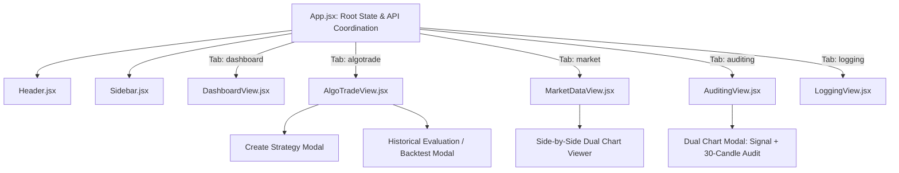

# TxBot Code Index: Frontend Components (`frontend/src/components`)

> **Index Identifier**: `frontend/src/components`  
> **Index Suffix**: `COMPONENTS`  
> **Source Directory**: [`frontend/src/components/`](file:///e:/Txbot/frontend/src/components)  
> **Role**: React UI presentation components, strategy controllers, chart visualizers, audit tables, and live telemetry dashboards.

---

## 1. Components Overview & Architecture

The frontend components implement an intuitive, dark-themed command center for non-technical traders and quantitative developers alike. Built using **React + Vite + Tailwind/Modern CSS + Lucide Icons**, every component communicates with the FastAPI backend through the central [`api.js`](file:///e:/Txbot/frontend/src/api.js) client.

### Key Architectural Traits
- **Non-Technical User Experience**: Visual strategy creation forms, one-click start/stop controls, color-coded status badges, and interactive chart previews.
- **Embedded Chart Modals**: Renders interactive TradingView Lightweight Charts directly within responsive iframe panels.
- **Side-by-Side Dual Comparison**: Synchronously compares two instruments across different timeframes with dual chart viewers.
- **Audit & +30 Candle Verification**: Visual inspection of historical trade outcomes with signal execution charts side-by-side with 30-candle follow-through charts.

---

## 2. Component Inventory & Symbol Catalog

| Component | Source File | Props & Key State | Role & Responsibilities |
|---|---|---|---|
| [`Header`](file:///e:/Txbot/frontend/src/components/Header.jsx) | `Header.jsx` | `systemStatus`, `onRefresh`, `onRunAll`, `isRunningAll`, `moduleTitle` | Top navigation bar displaying real-time exchange session status (OPEN/CLOSED), countdown to open/close, India VIX regime pill, ADR sentiment, and global trigger controls. |
| [`Sidebar`](file:///e:/Txbot/frontend/src/components/Sidebar.jsx) | `Sidebar.jsx` | `currentModule`, `onSelectModule`, `activeAlgosCount`, `signalsCount` | Primary navigation drawer providing tab switching across Dashboard, AlgoTrade, Market Data, Auditing, and Logs with live badge counters. |
| [`DashboardView`](file:///e:/Txbot/frontend/src/components/DashboardView.jsx) | `DashboardView.jsx` | `algos`, `signals`, `pnlSummary`, `systemStatus`, `onStartAlgo`, `onStopAlgo`, `onPauseAlgo`, `onSelectModule` | Executive command center featuring 6 KPI cards (Active Algos, PnL %, Win Rate %, Total Signals, VIX, ADR), active strategy cards, and live signals feed. |
| [`AlgoTradeView`](file:///e:/Txbot/frontend/src/components/AlgoTradeView.jsx) | `AlgoTradeView.jsx` | `algos`, `onStart`, `onStop`, `onPause`, `onCopy`, `onDelete`, `onCreate`, `onEvaluate` | Strategy management suite: search/filter, strategy creation modal (symbols, indicators, patterns, schedule, R:R), strategy cards, and backtest runner modal. |
| [`MarketDataView`](file:///e:/Txbot/frontend/src/components/MarketDataView.jsx) | `MarketDataView.jsx` | `systemStatus` | Interactive market data laboratory: on-demand candle fetcher, trend indicators, saved queries history, chart preview iframe, and side-by-side comparison. |
| [`AuditingView`](file:///e:/Txbot/frontend/src/components/AuditingView.jsx) | `AuditingView.jsx` | `algos`, `onResendSignal` | Strategy audit explorer grouped by AlgoTrade name: signals table, reason inspection, +30 candle verification chart viewer, and Telegram signal resend. |
| [`LoggingView`](file:///e:/Txbot/frontend/src/components/LoggingView.jsx) | `LoggingView.jsx` | None (internal polling via `api.getLogs`) | Real-time terminal-style logs viewer supporting source filtering (`market`, `signals`, `delivery`, `all`), search query filter, and error highlighting. |

---

## 3. Component Hierarchy & Data Flow

---

## 4. Detailed Component Specifications

### 4.1 [`AlgoTradeView.jsx`](file:///e:/Txbot/frontend/src/components/AlgoTradeView.jsx)
- **State Management**:
  - `showCreateModal: bool` — Toggles strategy configuration dialog.
  - `evaluatingAlgo: Optional[object]` — Target strategy for backtesting.
  - `evaluationResult: Optional[object]` — Rendered `StrategyEvaluationReport` payload.
  - `filterStatus`, `filterCreator`, `searchTerm` — Active card filters.
- **Workflows**:
  1. *Creation*: Collects name, market, timeframe, symbols list, indicators, patterns, start/stop times, and calls `onCreate(data)`.
  2. *Lifecycle*: Buttons trigger `onStart(id)`, `onStop(id)`, `onPause(id)`, `onCopy(id)`, `onDelete(id)`.
  3. *Backtest*: Selects date range, triggers `onEvaluate(id, {start_date, end_date})`, displays win rate, trade list, and profit factor.

### 4.2 [`AuditingView.jsx`](file:///e:/Txbot/frontend/src/components/AuditingView.jsx)
- **State Management**:
  - `selectedAlgoName: str` — Currently inspected strategy.
  - `activeChartModal: Optional[dict]` — Modal state holding `chart_url` and `audit_chart_url`.
- **Workflows**:
  1. *Select Strategy*: Displays signals generated by that specific strategy.
  2. *Inspect Chart*: Opens dual-panel modal with the execution chart and the +30 future candles audit chart to verify outcome.
  3. *Resend Alert*: Calls `onResendSignal(signal_id)` to re-dispatch to Telegram.

### 4.3 [`MarketDataView.jsx`](file:///e:/Txbot/frontend/src/components/MarketDataView.jsx)
- **Workflows**:
  1. *Fetch*: Calls `api.fetchMarketData(req)` and displays last 100 OHLCV bars + trend analysis summary.
  2. *On-Demand Chart*: Calls `api.generateChart(req)` and renders returned URL in a sandboxed iframe.
  3. *Side-by-Side Comparison*: Calls `api.compareCharts({symbol_a, symbol_b, timeframe_a, timeframe_b})` and renders dual split view.

---

## 5. Token-Saving AI Guide

- All backend endpoints called by these components are defined in [`frontend/src/api.js`](file:///e:/Txbot/frontend/src/api.js).
- If modifying UI layout, refer to the component inventory table above to find the exact JSX file.
- Components use CSS variables from [`frontend/src/index.css`](file:///e:/Txbot/frontend/src/index.css) (`--bg-primary`, `--bg-secondary`, `--bullish`, `--bearish`, `--accent-primary`).
