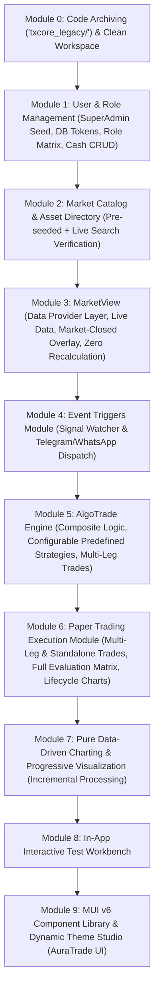

# AuraTrade: Master Modular Implementation Plan & Architecture Specification

> **Application Name**: **AuraTrade** (displayed prominently on the top-left of the UI)  
> **Mission & End Goal**: **An institutional ecosystem to monitor paper trades, strategies, and portfolio performance.**  
> **Core Concept**: An **`AlgoTrade`** is a configuration that combines events/strategies on a single asset to produce signals and execute multiple paper trades when trigger conditions are met.  
> **Naming Standard**: Strictly use **`AlgoTrade`** (all occurrences of `TradeAlgo` renamed in code). Module names remain distinct: `MarketView`, `Event Triggers`, `AlgoTrade`, `Paper Trading`, `Market Catalog`, `Test Workbench`.  
> **Reference Guarantee**: The legacy codebase will be preserved untouched in `txcore_legacy/` for implementation reference.  
> **Standard Compliance**: Market-Agnostic Architecture ([`GEMINI.md`](file:///e:/Txbot/GEMINI.md))  
> **Backend Stack**: Python 3.14 + FastAPI + Prisma ORM + PostgreSQL (TimescaleDB) + `decimal.Decimal`  
> **Frontend Stack**: React 19 + Vite 8 + Material UI (MUI v6) + Emotion + Lucide Icons  
> **Design Specification**: [Material UI Component Library](https://mui.com/material-ui/all-components/)  
> **Status**: Approved & Iterated with User Directives  

---

## 1. Development & Implementation Approach (Strict Rules)

To ensure zero regressions, clean architecture, and complete stability, every phase follows this strict protocol:

1. **Feature-by-Feature Incremental Delivery**:
   - **DO NOT implement an entire module in a single go.**
   - Every module is broken down into granular, independently testable features.
   - Before implementing any individual feature, a mini-implementation plan with deep research and gap analysis must be formulated and reviewed.
2. **Deep Research & Cross-Module Gap Analysis**:
   - Every feature plan must explicitly analyze how it interfaces with other modules:
     - How `MarketView` provides cached, incremental OHLCV data to `Event Triggers`, `AlgoTrade`, and `Paper Trading`.
     - How `Event Triggers` feed into `AlgoTrade`.
     - How `AlgoTrade` dispatches multi-leg trades into `Paper Trading`.
     - How `Paper Trading` standalone creation reuses the AlgoTrade trade profile builder.
     - How individual Paper Trade evaluation matrices aggregate up to the parent AlgoTrade evaluation score.
     - How the `Risk Manager` in PostgreSQL enforces limits without in-memory state drift.
   - Cross-module integration questions will be resolved before code is written.
3. **Dual Verification (Automated + Self-Intelligent Testing)**:
   - Rely on both automated test cases AND exploratory testing with realistic test vectors.
   - Code must be validated against loopholes, race conditions, edge cases, and precision misses before sign-off.
4. **Reference Codebase**:
   - Inspect the archived `txcore_legacy/` directory whenever verifying existing mathematical algorithms, provider adapters, or execution logic.
5. **No Synthetic / Dummy Data**:
   - Zero hardcoded mock candles or synthetic account balances. All execution runs against PostgreSQL and live or real historical market data.

---

## 2. Core Architectural Directives

1. **User Authentication & Dynamic Role-Based Module Display (Module 1)**:
   - **Default SuperAdmin**: Seeded on startup with Email: `rajat.18.ds@gmail.com` and Password: `Abcd@1234` with an initial virtual cash balance of ₹1,000,000.
   - Authentication via `username` or `email` + `password`.
   - **Database-Stored Token Sessions**: Server-side session tokens are stored directly in a dedicated PostgreSQL table (`user_sessions` / `session_tokens`) with expiry, user agent, and revocation tracking. No in-memory-only or stateless JWT-only session handling.
   - **Role System**: Base roles: `ADMIN`, `TRADER`, `AUDITOR` (`VIEWER` removed).
   - **Dynamic Role Creation & Module Matrix**: SuperAdmin can create custom roles in the UI, toggling checkboxes for each module's visibility and access permissions.
   - **Cash Balance Management**: SuperAdmin can credit, debit, or reset virtual balances for any user account via the User Management screen.

2. **Market Catalog & Asset Management (Module 2)**:
   - **Pre-Seeded Catalog**: Benchmark assets pre-seeded across markets (NSE, BSE, US, Forex, Crypto, MCX Commodities) with exchange, symbol, name, and precision rules.
   - **Asset Verification Engine**: When an Admin or User adds a new stock, index, crypto pair, or commodity:
     - The system queries market data APIs to verify that the asset actually exists in the specified market.
     - Search capability by Company Name or Symbol / Ticker (e.g. `RIL`, `IEX`, `RELIANCE`, `TCS`, `BTCUSDT`).
     - **Error Handling**: If the asset is not found, an explicit, user-friendly error message is displayed (e.g., `"Asset 'XYZ' could not be found or verified on NSE. Please verify the symbol or company name."`).
   - **Strict Decimal Precision Rules**:
     - Stocks: 4 decimal places (`0.0001`).
     - Crypto, Forex, and Commodities: 6 decimal places (`0.000001`).
   - Local 20-day historical cache pre-seeded across 5m & 15m timeframes for key benchmarks (`RELIANCE`, `TCS`, `HDFCBANK`, `NIFTY 50`, `BANKNIFTY`, `EURUSD`, `BTCUSDT`).

3. **MarketView: Data Provider & Interactive Market Data Engine (Module 3 — CRITICAL NEW MODULE)**:
   - Positioned as the foundational data provider layer directly before Event Triggers and AlgoTrade.
   - **Market & Asset Selection**: Dropdowns populated directly from the Market Catalog.
   - **Timeframe & Range Selection**: Defaults to live market data, with historical date and time range picker.
   - **Market-Closed Status Banner**: If the selected market is closed (e.g. NSE outside 09:15–15:30 IST, weekends, trading holidays), an informational badge/overlay is displayed on the chart: `"Market Closed • Displaying Last Traded Price at <timestamp>"`.
   - **Optional Overlays & Add-ons**: Users can selectively toggle on/off:
     - Technical indicators (EMA 9/21/50/200, VWAP, RSI, MACD, ATR, Bollinger Bands).
     - Safety & volatility filters.
     - Open Interest (OI) & Volume analysis (for derivative contracts/indices where available).
     - VIX correlation overlay (India VIX / CBOE VIX).
     - Candlestick patterns overlay.
   - **High-Performance Live Provider Selection**:
     - Grounded in deep research for free, accurate, and ultra-low-latency providers per market:
       - Indian Equities & Indices: Fast TradingView lightweight websocket/quote feed with Yahoo Finance fallback and public quote scrapers.
       - US Equities: Finnhub free tier & Yahoo Finance rapid quote.
       - Crypto: Binance public websocket (0ms auth, real-time depth & trades).
       - Forex: Binance FX / Finnhub / Yahoo Finance real-time FX rates.
       - MCX Commodities: Fast TradingView / MCX live quote adapters.
     - Automatic failover if primary provider drops.
   - **Provider Pre-Calculation Offloading**: Wherever the external provider offers pre-calculated technicals, indicators, OI, or patterns, fetch directly from the provider to save local CPU/memory.
   - **Strict Incremental Computation Guarantee**:
     - When the 180 initial candles are calculated, **ONLY new incoming candles are processed**.
     - Past candles are NEVER recalculated. Running state (rolling EMA, rolling VWAP, running RSI) is updated in O(1) time per new candle tick.

4. **Event Triggers Module (Module 4)**:
   - Standalone named watcher on a **single chosen asset** (stock, crypto, commodity, currency).
   - Monitors 1 or more signal rules: Candlestick patterns, price spike/crash (% in N candles), volume spikes (N x 20-period SMA), Support/Resistance level breaks, indicator threshold crosses (RSI, EMA).
   - Fully configurable trigger threshold values.
   - Dispatches signals directly to configured messaging channels (**Telegram**, **WhatsApp**).
   - **Does NOT execute trades**. Standalone watcher only.
   - UI: List View with search, Create Event Modal, and Details Page showing trigger history, threshold values, channel targets, and active status.

5. **AlgoTrade Architecture (Module 5)**:
   - Runs on a **single asset** (stock, crypto, commodity).
   - Constructed either by:
     - Combining custom threshold events from the Event Triggers Module with trigger logic (`ALL`, `ANY`, or custom formula), OR
     - Selecting a **Predefined Strategy** (e.g. **PDF Price Action Strategy** — S/R level rejection + ATR risk brackets + 15m MTF trend confirmation).
   - **Fully Configurable Predefined Strategies**: Users can customize all strategy parameters in the UI/API:
     - Base candle timeframe (e.g. 1m, 5m, 15m, 1h).
     - Indicator thresholds (RSI overbought/oversold, EMA periods).
     - Candle spike/breakout thresholds (% change, volume multiplier).
     - ATR risk multiplier and S/R buffer tolerances.
   - Dispatches signals to configured messaging channels (**Telegram**, **WhatsApp**).
   - Automatically executes **multiple paper trades** upon signal confirmation via configurable trade profiles.
   - **Aggregate Evaluation Score**: The AlgoTrade's evaluation is the mathematical aggregate of all its child paper trades' evaluations.
   - **Safe Cascading Deletion**: Deleting an AlgoTrade presents a confirmation modal warning of the exact count of paper trades and chart files being permanently purged.
   - UI: List View, Create AlgoTrade Wizard with "+ Add Trade Profile" builder, Search, Details Page, and an action button to evaluate historical performance.

6. **Paper Trading Execution Module (Module 6)**:
   - Can be triggered automatically by an AlgoTrade signal, **OR created directly via a standalone "Create Paper Trade" button** that opens the same "Add Trade Profile" builder (independent paper trade, unlinked to any AlgoTrade).
   - Executes **multiple paper trades simultaneously** on signal occurrence, each with independent parameters:
     - Strike/Entry price, position direction (`CALL`/`PUT`), fixed quantity/capital, stop loss strategy, target strategy, dynamic trailing stop (N x ATR), timeframe, MTF, and auto-exit expiration duration.
   - **Unified Evaluation Metric Matrix**: Every individual paper trade has its own complete evaluation matrix:
     - Realized PnL & ROI %.
     - Max Favorable Excursion (MFE) & Max Adverse Excursion (MAE).
     - Risk-to-Reward ratio achieved.
     - Slippage and execution latency.
     - Trade duration and exit reason (Target, Stop Loss, Trailing Stop, Timeout, Manual).
     - The parent AlgoTrade aggregates these matrices into a unified scorecard.
   - **Zero RAM Risk Manager**: All daily drawdown limits, max open positions, consecutive loss streak counters, and cooling-off timers are stored and queried directly in PostgreSQL (ACID compliant).
   - **Full-Lifecycle Chart Generation**:
     - 180 initial historical candles fetched + entry latency candles + trade duration candles.
     - Flexible slider for `<x>` post-exit candles:
       - If `<x> == 0`: Instant final chart rendered at trade exit.
       - If `<x> > 0`: Waits for `<x>` follow-through candles to close, then renders the full composite timeline with event trigger markers, entry line, stop-loss, exit point, and post-trade price action.
     - Incremental calculation: Only the new incoming candle is processed for indicator/chart updates.

7. **Pure Data-Driven Charting & Progressive Visualization (Module 7)**:
   - Candlesticks rendered **strictly from OHLCV + Volume data**. Zero pattern-recognition dependencies driving the charts.
   - **Incremental Computation Guarantee**: Once 180 candles are loaded, only newly closed candles are evaluated. Historical candles are never recomputed.
   - **Progressive Rendering Pipeline**: Raw candles, S/R levels, indicators (EMA, VWAP, RSI, ATR), and Volume pane render first; secondary analytics process asynchronously.
   - **Pre-Render Diagnostic Timing Banner**: `Data fetched in <x>s | Chart rendered in <y>s | Total: <z>s` displayed above canvas and streamed to console.
   - Tooltips and price axes strictly adhere to 4/6 decimal precision.

8. **In-App Test Management & Interactive Test Workbench (Module 8)**:
   - **List View**: Catalog of all tests grouped by module, pass/fail status chips, execution duration, loophole severity.
   - **Details View**: Real-world scenario breakdown, assertion chain, side-by-side visual diff (expected vs actual), server execution logs.
   - **Interactive Workbench**: Live parameter injection controls, "Run Live Test", and "Run All in Module".
   - **Native Async Test Engine**: Millisecond execution times with isolated DB transaction rollbacks + CLI pytest runner.
   - Core loophole test library + custom scenario builder to save new test cases from the UI.

9. **Frontend Material UI (MUI v6) Design System & Dynamic Theme Studio (Module 9)**:
   - Strictly follow [Material UI Component Library](https://mui.com/material-ui/all-components/) with precision padding, margin, elevation, and layout.
   - Responsive layout: Collapsible Drawer + Top AppBar branded as **"AuraTrade"** with live telemetry and Theme Studio drawer.
   - Light and Dark modes with live color pickers (Primary, Secondary, Backgrounds, Text, Headings), Google Fonts customizer, and geometry controls.

---

## 3. Re-Mapped Module Sequence & Dependency Graph

---

## 4. Feature-by-Feature Detailed Specifications

#### Module 0: Architecture Archiving & Clean Workspace
- [x] **Feature 0.1: Legacy Codebase Archiving** — Complete exact duplicate of `txcore/` in `txcore_legacy/` (59 non-cache files matched, `README.md` added).
- [x] **Feature 0.2: Clean Modular Package Scaffolding** — Scaffolding of `auth/`, `catalog/`, `marketview/`, `events/`, `algotrade/`, `paper/`, `visualization/`, `test_engine/` with typed exports and `CODE_INDEX_TXCORE.md`.
- [x] **Feature 0.3: Database Connectivity & Migration Baseline** — Event-loop-safe Prisma connection manager in `txcore/database.py`, health ping, tested with 100% pass rate.

---

### Module 1: User & Role Management (Authentication, Tokens, Role Matrix & Cash CRUD)
**Status**: **100% Completed & Verified**

#### Feature Achievements (1 Sentence Each)
- **Feature 1.1 (Database Schema for Auth, Sessions & Roles)**: Designed and migrated PostgreSQL models (`User`, `UserSession`, `Role`, `RolePermission`, `AccountBalance`, `BalanceAdjustmentLog`) enforcing `Decimal(18, 4)` cash precision.
- **Feature 1.2 (Password Security & SuperAdmin Auto-Seeding)**: Implemented OWASP PBKDF2-HMAC-SHA256 password hashing and an idempotent startup seeder that guarantees the default SuperAdmin (`rajat.18.ds@gmail.com` / `Abcd@1234`) with ₹1,000,000.00 cash balance.
- **Feature 1.3 (Database-Stored Session Token Management)**: Implemented cryptographically secure 32-byte hex session tokens stored as SHA-256 hashes in `user_sessions` with database revocation for real logouts.
- **Feature 1.4 (Dynamic Role Management & Module Matrix API)**: Built REST API endpoints for user login, logout, profile retrieval, and dynamic role CRUD with system role deletion protection.
- **Feature 1.5 (Virtual Cash Balance Top-Up & Audit API)**: Implemented user creation, role reassignment, and cash balance top-ups with immutable ACID audit trails in `balance_adjustment_logs`.
- **Feature 1.6 (Frontend MUI Login Page & Auth Context)**: Developed a persistent React `AuthContext` and institutional login page validating session tokens against the backend.
- **Feature 1.7 (Frontend MUI User Management & Role Matrix Screen)**: Built an institutional administrative interface featuring a live User DataGrid, Cash Top-Up modal with presets, and an interactive module permission checkbox matrix.
- **Feature 1.8 (Dynamic Navigation Filtering & AuraTrade Branding)**: Branded the platform as AuraTrade and implemented dynamic sidebar menu filtering that hides unpermitted modules based on the active role's database permissions.

#### Feedback Work Done & Iterations (1 Sentence Each)
- **Feedback Item 1 (Full-Page Login)**: Replaced the modal popup with a dedicated, full-screen institutional `LoginPage.jsx` with elevated surface styling and zero dashboard background bleed.
- **Feedback Item 2 (No Default Values & No Quick Button)**: Removed the "Fill Super Admin" button and cleared all input default values so credentials initialize completely blank.
- **Feedback Item 3 (Focus Textbox Bug Fixed)**: Excluded Material UI inputs from global CSS rules in `index.css` and added transparent focus overrides to prevent textboxes from turning black on click.
- **Feedback Item 4 (DBeaver Seeded Data Verification)**: Verified that all 14 PostgreSQL tables and seeded SuperAdmin records exist in the `txbot` database and documented exact DBeaver connection, refresh (F5), and query instructions.

#### Phase 1 Deliverables Inventory
- **Backend Components & Routers**:
  - [`txcore/database.py`](file:///e:/Txbot/txcore/database.py) — Loop-aware Prisma connection manager and PostgreSQL health ping service.
  - [`txcore/auth/security.py`](file:///e:/Txbot/txcore/auth/security.py) — PBKDF2-HMAC-SHA256 password hashing (600,000 iterations) with constant-time verification.
  - [`txcore/auth/seeder.py`](file:///e:/Txbot/txcore/auth/seeder.py) — Idempotent seeder for system roles (`ADMIN`, `TRADER`, `AUDITOR`) and default SuperAdmin (`rajat.18.ds@gmail.com`).
  - [`txcore/auth/sessions.py`](file:///e:/Txbot/txcore/auth/sessions.py) — Cryptographic session token generation, SHA-256 database storage, and revocation engine.
  - [`txcore/auth/dependencies.py`](file:///e:/Txbot/txcore/auth/dependencies.py) — FastAPI dependency injectors for session extraction and module RBAC enforcement.
  - [`txcore/auth/router.py`](file:///e:/Txbot/txcore/auth/router.py) — REST API router for `/auth/login`, `/auth/logout`, `/auth/me`, and `/roles` CRUD.
  - [`txcore/auth/user_router.py`](file:///e:/Txbot/txcore/auth/user_router.py) — REST API router for `/users` listing, user creation, role reassignment, and cash balance top-ups.
  - [`txcore/service.py`](file:///e:/Txbot/txcore/service.py) — Clean FastAPI application mounting auth, user, and health check routers.
  - [`prisma/schema.prisma`](file:///e:/Txbot/prisma/schema.prisma) — Database schema with models `User`, `UserSession`, `Role`, `RolePermission`, `AccountBalance`, and `BalanceAdjustmentLog`.
- **Frontend Components & Contexts**:
  - [`frontend/src/context/AuthContext.jsx`](file:///e:/Txbot/frontend/src/context/AuthContext.jsx) — Central authentication context managing token persistence, session hydration, and `hasPermission` checks.
  - [`frontend/src/components/auth/LoginPage.jsx`](file:///e:/Txbot/frontend/src/components/auth/LoginPage.jsx) — Full-page institutional login screen with clean Material UI text fields and loading states.
  - [`frontend/src/components/admin/UserManagementScreen.jsx`](file:///e:/Txbot/frontend/src/components/admin/UserManagementScreen.jsx) — Tabbed administrative screen with User DataGrid and interactive Role Permissions Matrix.
  - [`frontend/src/components/admin/CashTopupModal.jsx`](file:///e:/Txbot/frontend/src/components/admin/CashTopupModal.jsx) — Modal for crediting/debiting virtual cash with quick chips (+₹50k, +₹100k, +₹500k, +₹1M) and audit reason.
  - [`frontend/src/components/admin/CreateRoleModal.jsx`](file:///e:/Txbot/frontend/src/components/admin/CreateRoleModal.jsx) — Modal for constructing custom roles with module-level permission checkboxes.
  - [`frontend/src/components/admin/CreateUserModal.jsx`](file:///e:/Txbot/frontend/src/components/admin/CreateUserModal.jsx) — Modal for adding new users with role assignment and initial balance.
  - [`frontend/src/components/Sidebar.jsx`](file:///e:/Txbot/frontend/src/components/Sidebar.jsx) — AuraTrade branded navigation drawer dynamically filtering menu items based on permissions.
  - [`frontend/src/components/Header.jsx`](file:///e:/Txbot/frontend/src/components/Header.jsx) — Top header displaying real user name, role badge, live virtual balance pill, and logout trigger.
  - [`frontend/src/api.js`](file:///e:/Txbot/frontend/src/api.js) — Central API client with automatic Bearer token injection and credentials support.
  - [`frontend/src/index.css`](file:///e:/Txbot/frontend/src/index.css) — Global styles updated to exclude Material UI inputs and prevent black focus backgrounds.
- **Automated Test Suites (100% Passing)**:
  - [`tests/test_database_connection.py`](file:///e:/Txbot/tests/test_database_connection.py) — Verifies PostgreSQL connection, loop detection, and health latency.
  - [`tests/test_feature_1_1_schema.py`](file:///e:/Txbot/tests/test_feature_1_1_schema.py) — Verifies Prisma models, foreign key cascades, and Decimal arithmetic.
  - [`tests/test_feature_1_2_seeder.py`](file:///e:/Txbot/tests/test_feature_1_2_seeder.py) — Verifies password security, SuperAdmin credentials, and seeder idempotency.
  - [`tests/test_feature_1_3_sessions.py`](file:///e:/Txbot/tests/test_feature_1_3_sessions.py) — Verifies SHA-256 token storage, expiry rejection, and logout revocation.
  - [`tests/test_feature_1_4_api.py`](file:///e:/Txbot/tests/test_feature_1_4_api.py) — Verifies login/logout/me APIs, role creation, and system role protection.
  - [`tests/test_feature_1_5_balance_api.py`](file:///e:/Txbot/tests/test_feature_1_5_balance_api.py) — Verifies user management, cash top-ups, and balance audit logs.

---

### Module 2: Market Catalog & Asset Directory (Pre-Seeding, Search Verification & Error Handling)
- **Feature 2.1: Database Schema for Markets & Symbols**
  - Models:
    - `Market`: `id`, `code` (`NSE`, `BSE`, `US_EQUITY`, `FOREX`, `CRYPTO`, `MCX`), `name`, `timezone`, `currency`, `is_active`.
    - `MarketSymbol`: `id`, `market_id`, `symbol`, `name`, `asset_type` (`EQUITY`, `INDEX`, `FOREX`, `CRYPTO`, `COMMODITY`), `decimal_places` (4 for stocks, 6 for crypto/forex/commodities), `is_preseeded`, `is_active`.
- **Feature 2.2: Benchmark Pre-Seeding**
  - Pre-seed standard benchmark symbols:
    - Indian Equities & Indices: `NIFTY 50`, `BANKNIFTY`, `RELIANCE`, `TCS`, `HDFCBANK`, `INFY`, `ICICIBANK`.
    - US Equities & Indices: `SPY`, `QQQ`, `AAPL`, `MSFT`, `NVDA`, `TSLA`.
    - Crypto Pairs: `BTCUSDT`, `ETHUSDT`, `SOLUSDT`.
    - Forex Pairs: `EURUSD`, `GBPUSD`, `USDJPY`, `USDINR`.
    - MCX Commodities: `GOLD`, `SILVER`, `CRUDEOIL`.
- **Feature 2.3: Asset Search & Verification Engine**
  - Implement a verification engine that queries live market APIs when a user adds a new asset:
    - Search by Company Name (e.g. `Reliance Industries`) or Ticker/Symbol (e.g. `RIL`, `RELIANCE`, `IEX`).
    - Verify ticker exists on the chosen exchange.
    - If verified: Auto-populate asset name, correct symbol, precision rules, and persist in database.
    - **If not found**: Return an explicit, user-friendly error response: `"Asset '<query>' could not be found or verified on <market>. Please check the symbol or company name."`
- **Feature 2.4: 20-Day Benchmark Historical Data Cache**
  - Pre-seed local cached OHLCV data for the past 20 trading days across 5m and 15m intervals for benchmark symbols to enable instant offline/local development without rate limits.
- **Feature 2.5: Frontend MUI Market Catalog Management Screen**
  - Searchable DataGrid of all assets with market filter, asset type chip, and decimal precision badge.
  - "Add Asset" Modal with live company name/symbol search, market selector, instant verification indicator, and clear error banner if unverified.

---

### Module 3: MarketView (Data Provider Layer, Live Data & Incremental Engine)
- **Feature 3.1: Data Provider Architecture & Adapter Registry**
  - `BaseDataProvider` interface with standard methods:
    - `fetch_candles(symbol, timeframe, start_time, end_time) -> List[Candle]`
    - `fetch_live_quote(symbol) -> LiveQuote`
    - `fetch_market_status(market) -> MarketStatus`
    - `fetch_provider_technicals(symbol, indicators) -> Dict[str, Any]` (for pre-calculated indicators/OI/patterns).
  - Concrete adapters:
    - `TradingViewLightweightProvider`: Ultra-fast quote & candle stream.
    - `BinanceProvider`: Zero-auth live websocket & REST for crypto.
    - `YahooFinanceProvider`: Resilient fallback for global stocks, forex, and commodities.
    - `NseDirectProvider`: Session-backed quote parser for NSE India equities & indices.
- **Feature 3.2: Market-Closed Detection & Timing Overlay**
  - Implement market trading hours validator (considering market timezone, trading sessions, weekend, and holiday calendars).
  - When market is closed:
    - Returns `is_open = false`, `last_traded_price`, `last_traded_timestamp`, and `next_open_timestamp`.
    - Frontend renders informational banner overlay: `"Market Closed • Displaying Last Traded Price as of <timestamp>"`.
- **Feature 3.3: Interactive Range & Timeframe Selector**
  - Support standard timeframes: `1m`, `3m`, `5m`, `15m`, `30m`, `1h`, `1d`.
  - Toggle between **Live Streaming Data** (default) and **Custom Date/Time Range** historical view.
- **Feature 3.4: Optional Overlays & Add-on Engine**
  - API and UI controls to toggle optional overlays on top of raw candles:
    - Indicators: EMA (9, 21, 50, 200), VWAP, RSI (14), MACD, ATR, Bollinger Bands.
    - Open Interest (OI) & Volume profile overlays (for derivative contracts/indices).
    - VIX correlation indicator (India VIX for NSE, CBOE VIX for US).
    - Candlestick patterns detection markers.
- **Feature 3.5: Provider Pre-Calculation Offloading**
  - When the selected data provider supports pre-calculated technicals, indicators, or patterns, fetch directly from provider endpoints to eliminate local CPU computation.
- **Feature 3.6: Strict Incremental Computation Engine (Zero Recalculation)**
  - Load initial 180 historical candles into state/cache.
  - When a new candle tick or close arrives:
    - **Compute ONLY the new candle**.
    - Maintain running accumulator states (e.g. running EMA multiplier, rolling VWAP cumulative typical price x volume, running RSI smoothed gains/losses).
    - **Zero recalculation of the 180 past candles**. Execution time per incoming candle tick: < 1 millisecond.
- **Feature 3.7: Frontend MUI MarketView Terminal Screen**
  - Top control bar: Market & Asset dropdowns (from Catalog), Timeframe selector, Live/Historical toggle, and "Add Overlays" multi-select menu.
  - Market-closed alert banner when market is inactive.
  - High-performance chart canvas rendering candlesticks, volume pane, and toggled overlays with pre-render diagnostic timing banner.

---

### Module 4: Event Triggers Module (Standalone Signals & Dispatch)
- **Feature 4.1: Database Schema for Event Triggers**
  - Model `EventTrigger`: `id`, `name`, `symbol_id`, `event_type` (`CANDLE_PATTERN`, `PRICE_SPIKE`, `VOLUME_SPIKE`, `SR_BREAK`, `INDICATOR_CROSS`), `threshold_config` (JSON), `messaging_channels` (`TELEGRAM`, `WHATSAPP`), `status` (`ACTIVE`, `PAUSED`, `DELETED`), `last_triggered_at`, `owner_id`, `created_at`.
- **Feature 4.2: Standalone Signal Rule Evaluators**
  - Price Spike / Crash: detects `>` X% change within N candles.
  - Volume Spike: detects volume `>` N times 20-period SMA.
  - Support / Resistance Break: detects candle close breaking dynamic or static S/R level.
  - Indicator Cross: detects RSI overbought/oversold, EMA crossover (e.g. 9 EMA cross 21 EMA).
  - Candlestick Patterns: detects Hammer, Shooting Star, Bullish/Bearish Engulfing, Morning/Evening Star.
- **Feature 4.3: Background Event Evaluation Worker**
  - Non-blocking asyncio background worker evaluating active Event Triggers on incoming candles from MarketView.
  - Deduplication lock: prevents duplicate triggers on the same candle.
  - **Notice**: Standalone watcher ONLY — **does NOT execute trades**.
- **Feature 4.4: Multi-Channel Alert Dispatcher (Telegram & WhatsApp)**
  - Async dispatchers formatting clear, institutional alert cards:
    - Asset, Trigger Type, Trigger Price, Threshold Met, Timestamp, Chart Link.
  - Resilient retry logic with exponential backoff.
- **Feature 4.5: Frontend MUI Event Triggers Screens**
  - List View: Status badge (Active/Paused), Asset chip, Event Type, Threshold summary, Channel icons, and actions (Toggle Pause, Edit, Delete).
  - "Create Event Trigger" Modal: Asset selector, Event type selector, dynamic threshold inputs, channel checkboxes.
  - Details Page: Trigger event audit log, threshold configuration inspector, dispatch delivery history.

---

### Module 5: AlgoTrade Engine (Composite Logic, Configurable Predefined Strategies & Multi-Leg Execution)
- **Feature 5.1: Database Schema for AlgoTrade**
  - Model `AlgoTrade`: `id`, `name`, `symbol_id`, `trigger_mode` (`ALL_EVENTS`, `ANY_EVENT`, `CUSTOM_FORMULA`, `PREDEFINED_STRATEGY`), `event_trigger_ids` (array of linked triggers), `predefined_strategy_key`, `strategy_config` (JSON for customizable thresholds/timeframes), `trade_profiles_config` (JSON array of multi-leg trade parameters), `messaging_channels` (array), `status` (`ACTIVE`, `PAUSED`, `DELETED`), `owner_id`, `created_at`.
- **Feature 5.2: Configurable Predefined Strategy Engine**
  - Coded Strategy: **PDF Price Action Strategy**:
    - S/R level bounce/breakout + ATR dynamic risk brackets + 15m MTF trend filter.
  - **Full Customizability**:
    - Timeframe selector (e.g. 1m, 3m, 5m, 15m, 1h).
    - Indicator thresholds (RSI limits, EMA periods).
    - Candle spike/breakout thresholds (% change, volume surge multiplier).
    - S/R lookback buffer and ATR multipliers for stop/target.
- **Feature 5.3: Composite Trigger Evaluator**
  - For custom combinations: evaluates whether all linked Event Triggers, any trigger, or a custom formula evaluated to TRUE on the closed candle.
- **Feature 5.4: Background AlgoTrade Pipeline Runner**
  - Asyncio worker processing symbol candle ticks, verifying trigger conditions, and firing multi-leg trade dispatches upon signal confirmation.
- **Feature 5.5: Aggregate Evaluation Metrics Engine**
  - Evaluates overall AlgoTrade performance:
    - **Mathematically aggregated directly from all child paper trades**:
      - Total PnL & Cumulative ROI.
      - Aggregate Win Rate (% profitable trades).
      - Profit Factor (Gross Profits / Gross Losses).
      - Average Trade Duration.
      - Max Aggregate Drawdown.
- **Feature 5.6: Safe Cascading Deletion Engine & Modal**
  - Deleting an AlgoTrade safely prompts a confirmation modal displaying:
    - Number of open paper trades to be closed.
    - Number of historical paper trades to be purged.
    - Number of chart files to be removed.
  - Executes deletion in an ACID PostgreSQL transaction.
- **Feature 5.7: Frontend MUI AlgoTrade Screens**
  - List View: Strategy Name, Asset, Mode chip, Status toggle, Win Rate chip, PnL chip, Actions.
  - Create AlgoTrade Wizard:
    - Step 1: Asset selection (from Catalog).
    - Step 2: Trigger Source (Composite Event Triggers vs Configurable Predefined Strategy).
    - Step 3: Strategy Parameters Configuration (timeframe, thresholds, spike multipliers).
    - Step 4: Multi-Leg "+ Add Trade Profile" Builder (configure 1 or more simultaneous paper trade legs).
    - Step 5: Notification channels & confirmation.
  - Details Page: Performance telemetry, aggregate scorecard, active positions, linked paper trade history, and "Evaluate Historical" trigger.

---

### Module 6: Paper Trading Execution Module (Multi-Leg & Standalone Trades, Full Evaluation Matrix & Lifecycle Charts)
- **Feature 6.1: Database Schema for Paper Trades & Positions**
  - Model `PaperTrade`: `id`, `algo_trade_id` (nullable for standalone trades), `user_id`, `symbol`, `direction` (`CALL`/`PUT`), `strike_price`, `quantity`, `entry_price`, `exit_price`, `stop_loss`, `target`, `trailing_stop_atr_multiplier`, `timeframe`, `mtf_config`, `exit_reason` (`TARGET`, `STOP_LOSS`, `TRAILING_STOP`, `TIMEOUT`, `MANUAL`), `status` (`OPEN`, `CLOSED`), `pnl`, `roi_pct`, `mfe`, `mae`, `risk_reward_achieved`, `slippage`, `trade_duration_seconds`, `created_at`, `closed_at`.
- **Feature 6.2: Standalone "Create Paper Trade" Execution**
  - Dedicated **"Create Paper Trade"** button on the Paper Trading dashboard.
  - Opens the identical "+ Add Trade Profile" form (direction, strike/entry, quantity, SL, Target, Trailing Stop, Timeframe).
  - Executes as an independent paper trade (with `algo_trade_id = null`), deducting virtual cash from the user's account and running with the same lifecycle and evaluation rules.
- **Feature 6.3: Multi-Leg Execution Dispatcher**
  - When an AlgoTrade fires a signal, the dispatcher parses `trade_profiles_config` and creates multiple distinct paper trade records in a single atomic transaction.
- **Feature 6.4: Zero RAM Risk Manager in PostgreSQL**
  - ACID validation executed directly against the database before any trade executes:
    - Max daily drawdown limit check.
    - Max concurrent open positions limit.
    - Consecutive loss streak check.
    - Cooling-off timer enforcement.
  - Deducts capital from `AccountBalance` with row-level locking (`FOR UPDATE`).
- **Feature 6.5: Trailing Stop Loss & Dynamic Exit Engine**
  - Evaluates incoming ticks:
    - Ratchets trailing stop loss upward for CALL (downward for PUT) by N x ATR.
    - Monitors target price reach.
    - Intraday timeout auto-exit.
  - Updates cash balance and records realized PnL on trade closure.
- **Feature 6.6: Comprehensive Evaluation Metric Matrix**
  - Computes complete trade metrics for every individual paper trade:
    - PnL, ROI %, Max Favorable Excursion (MFE), Max Adverse Excursion (MAE), Risk-to-Reward ratio, slippage, duration.
- **Feature 6.7: Full-Lifecycle Chart Generation & Post-Exit `<x>` Slider**
  - Chart spans 180 pre-signal historical candles + entry latency candles + trade duration candles.
  - Configurable post-exit `<x>` candle slider:
    - If `<x> == 0`: Instant final chart rendered immediately when trade exits.
    - If `<x> > 0`: Waits for `<x>` follow-through candles to complete, then generates final audit chart.
  - Visual overlays: Entry price line, stop-loss line, target line, exit point, event trigger markers, and trade PnL watermark.
  - Incremental computation: Only new incoming candles are evaluated; past candles cached.
- **Feature 6.8: Frontend MUI Paper Trading Dashboard**
  - Top Action Bar: Portfolio cash balance card, Net PnL card, Win Rate card, and "+ Create Paper Trade" button.
  - Active Positions DataGrid: Symbol, Direction chip, Entry, Current Price, Trailing SL, Target, Unrealized PnL, "Close Position" action.
  - Closed Trades History DataGrid: Full evaluation metrics, exit reason badge, and "View Lifecycle Chart" modal trigger.

---

### Module 7: Pure Data-Driven Charting & Progressive Visualization
- **Feature 7.1: Strict OHLCV + Volume Canvas Engine**
  - Pure data-driven candlestick rendering directly from OHLCV + Volume arrays.
  - Zero dependencies on pattern recognition or external heuristics to draw the chart.
- **Feature 7.2: Strict Incremental Computation Pipeline**
  - Cache initial 180 candles.
  - When new candle data arrives, **process ONLY the new candle**.
  - O(1) running accumulator updates for indicators and levels. Never recompute historical candles.
- **Feature 7.3: Pre-Render Diagnostic Timing Banner**
  - Banner displayed directly above the chart:  
    `Data fetched in <x>s | Chart rendered in <y>s | Total: <z>s`
  - Output logged to server console and telemetry stream.
- **Feature 7.4: Strict Decimal Precision Formatting**
  - Tooltips, cursor coordinates, and price axes strictly formatted:
    - 4 decimal places for stocks (`0.0001`).
    - 6 decimal places for crypto, forex, and commodities (`0.000001`).
- **Feature 7.5: Progressive Rendering Pipeline**
  - Phase 1: Candlesticks, volume bars, primary S/R levels render immediately.
  - Phase 2: Secondary indicators (RSI pane, MACD, secondary analytics) render asynchronously without UI freeze.

---

### Module 8: In-App Interactive Test Workbench
- **Feature 8.1: Native Async Test Engine**
  - Fast test execution in isolated PostgreSQL transactions with automatic rollbacks.
- **Feature 8.2: Core Loophole Test Library**
  - Pre-seeded test suites targeting real-world market failure modes:
    - Auth loopholes (expired session token, revoked token access, unauthorized module access).
    - Floating-point drift vs Decimal precision tests.
    - Market closed order rejections.
    - Asset verification failure handling.
    - Multi-leg execution atomicity (failure in one leg rolls back or marks partial properly).
    - Trailing stop ratchet monotonicity.
    - Incremental calculation verification (asserts past 180 candles are not recomputed).
    - Zero RAM risk manager limits.
- **Feature 8.3: Custom Scenario Builder**
  - UI builder allowing admins to construct custom test cases with parameter injection and expected assertions.
- **Feature 8.4: Frontend MUI Test Workbench Screens**
  - List View: Test name, module chip, loophole severity chip, last run status, execution time.
  - Details View: Assertion chain breakdown, live parameter injection controls, side-by-side visual diff (expected vs actual), server execution logs, and "Run Live Test" button.

---

### Module 9: MUI v6 Component Library & Dynamic Theme Studio
- **Feature 9.1: Material UI v6 Design System Integration**
  - Strictly follow [Material UI Component Library](https://mui.com/material-ui/all-components/) for all UI primitives: Buttons, AppBars, Drawers, DataGrids, Modals, Cards, Tabs, and Tooltips.
- **Feature 9.2: Dynamic Theme Studio Engine**
  - Base themes: Light and Dark.
  - Live Color Customizer:
    - Primary color, Secondary color, Background default & paper, Text primary & secondary, Heading color, Bullish/Success green, Bearish/Error red.
  - Typography Customizer: Google Fonts picker for headings and body, font size scaling.
  - Geometry Controls: Border radius, elevation shadows, component density (compact / comfortable).
  - Theme Presets: Save and load custom theme presets to `localStorage` and user settings.
- **Feature 9.3: AuraTrade Top AppBar & Responsive Navigation**
  - Top AppBar branded prominently with **"AuraTrade"** on top-left.
  - System status indicators: Live data latency badge, active AlgoTrade count, virtual cash balance pill, Theme Studio drawer toggle, and User profile avatar menu.
  - Collapsible navigation drawer filtered dynamically by role permissions.
