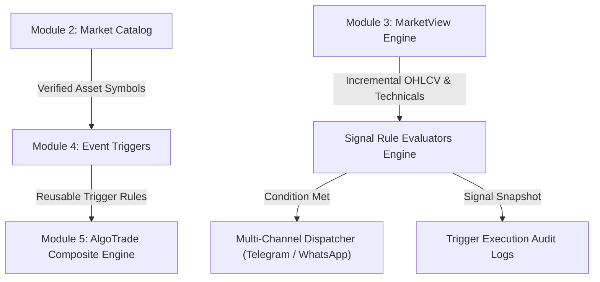

# Module 4: Event Triggers Module (Standalone Signals, Watchers & Multi-Channel Alert Dispatching)

## Overview & Mission
The **Event Triggers Module** provides institutional-grade, standalone market watchers on single financial assets across all platform markets (Indian Equities/Indices, US Equities, Crypto, Forex, and MCX Commodities).
An Event Trigger continuously monitors raw and synthetic market conditions from the **MarketView** layer, identifies signal conditions, and immediately dispatches alerts to configured channels (**Telegram**, **WhatsApp**) without executing paper trades.

---

## Architecture & Cross-Module Dependencies

---

## Phased Feature Breakdown

| Feature | Description | Status | Deliverables & Tests |
| :--- | :--- | :--- | :--- |
| **Feature 4.1** | **Database Schema & Models**: `EventTrigger`, `TriggerExecutionLog` models + enums (`TriggerType`, `TriggerStatus`, `ChannelType`) with institutional audit columns & soft-delete. | **Completed** ✅ | `prisma/schema.prisma`, `txcore/events/models.py`, `tests/test_feature_4_1_schema.py` |
| **Feature 4.2** | **Standalone Signal Rule Evaluators**: Price spikes, volume surges, S/R breaks, indicator crosses, and candlestick patterns. | **Completed** ✅ | `txcore/events/evaluators.py`, `tests/test_feature_4_2_evaluators.py` |
| **Feature 4.3** | **Multi-Channel Alert Dispatcher**: Async Telegram, WhatsApp, and Webhook dispatchers with delivery telemetry & ACID audit tracking. | **Completed** ✅ | `txcore/events/dispatcher.py`, `tests/test_feature_4_3_dispatcher.py` |
| **Feature 4.4** | **REST API & Instant Simulator**: CRUD endpoints, quick status toggle, soft-delete, execution logs, and live dry-run simulation endpoint. | **Completed** ✅ | `txcore/events/router.py`, `tests/test_feature_4_4_api.py` |
| **Feature 4.5** | **Background Evaluation Worker**: Batch group polling, market-provider caching, and candle-level deduplication locks. | **Completed** ✅ | `txcore/events/worker.py`, `tests/test_feature_4_5_worker.py` |
| **Feature 4.6** | **Frontend MUI Event Triggers Interface**: High-density dashboard, universal reactive filters, dynamic threshold creation modal, dry-run preview simulator, and audit inspector. | **Completed** ✅ | `frontend/src/components/events/EventTriggersScreen.jsx`, `CreateEventTriggerModal.jsx`, `EventDetailsModal.jsx`, `frontend/src/api.js` |

---

## Deliverables Summary
- **Backend Core**: Complete event evaluation and multi-channel alerting engine in [`txcore/events`](file:///e:/Txbot/txcore/events).
- **Automated Test Coverage**: 10 dedicated test suites in `tests/test_feature_4_*.py` with 100% pass rate.
- **Frontend Command Center**: Full Material UI Event Triggers interface integrated into navigation drawer and App shell.

