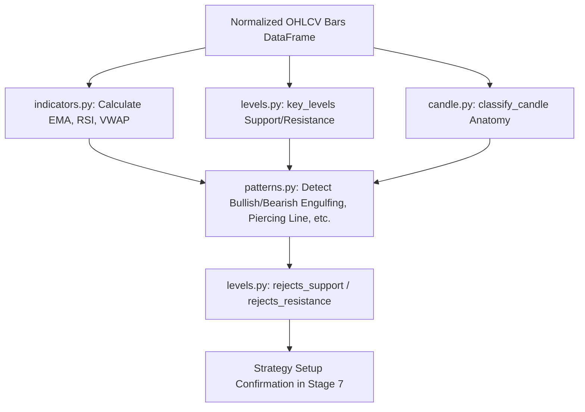

# TxBot Code Index: Analysis Module (`txcore/analysis`)

> **Module Identifier**: `txcore/analysis`  
> **Index Suffix**: `ANALYSIS`  
> **Source Directory**: [`txcore/analysis/`](file:///e:/Txbot/txcore/analysis)  
> **Role**: Mathematical, vectorized, and pure algorithmic functions for candle classification, level extraction, indicator computation, and price action pattern detection (Stages 3, 4, and 6).

---

## 1. Module Overview & Responsibilities

The `txcore.analysis` module contains the quantitative and mathematical core of the bot. Every function is designed as a **pure function** or stateless vectorized routine for thread-safety and high concurrency.

### Key Architectural Traits
- **Zero-Division & Edge-Case Safety**: Robust against zero ranges, identical open/close ticks, NaN inputs, and missing bars.
- **Rulebook Fidelity**: Directly encodes the rules from Ishaq's *Binary Options & Price Action Trading Guide*.
- **Vectorized & Fast**: Combines pandas/numpy operations for bulk indicators with zero-copy row access for pattern identification.

---

## 2. File Index & Exported Symbols

| File | Primary Functions & Exports | Key Responsibility |
|---|---|---|
| [`candle.py`](file:///e:/Txbot/txcore/analysis/candle.py) | `candle_parts`, `is_doji`, `is_dragonfly_doji`, `is_gravestone_doji`, `is_hammer`, `is_inverted_hammer`, `is_shooting_star`, `is_spinning_top`, `is_marubozu`, `weak_bullish`, `weak_bearish`, `classify_candle` | Single-bar geometry, body/wick proportions, and candlestick anatomy classification. |
| [`patterns.py`](file:///e:/Txbot/txcore/analysis/patterns.py) | `bullish_engulfing`, `bearish_engulfing`, `piercing_line`, `dark_cloud_cover`, `morning_star`, `evening_star` | Multi-bar pattern recognition with boundary tolerance. |
| [`levels.py`](file:///e:/Txbot/txcore/analysis/levels.py) | `key_levels`, `prior_downtrend`, `prior_uptrend`, `rejects_support`, `rejects_resistance` | Dynamic support/resistance calculation, trend confirmation, and wick level rejection. |
| [`indicators.py`](file:///e:/Txbot/txcore/analysis/indicators.py) | `calculate_ema`, `calculate_sma`, `calculate_rsi`, `calculate_macd`, `calculate_bollinger_bands`, `calculate_vwap`, `analyze_trend` | Technical indicators and multi-factor trend regime diagnostics. |
| [`period.py`](file:///e:/Txbot/txcore/analysis/period.py) | `filter_candles_by_date`, `parse_timeframe_to_minutes`, `slice_period` | Timeframe parsing and historical date window slicing. |
| [`volatility.py`](file:///e:/Txbot/txcore/analysis/volatility.py) | `analyze_vix`, `vix_regime_from_value` | India VIX classification, option pricing implications, and trade filtering. |

---

## 3. Function Signatures & Behavioral Contracts

### 3.1 Candlestick Anatomy (`candle.py`)

```python
def candle_parts(row: Union[pd.Series, Dict[str, Any], Candle]) -> Candle:
    """Normalizes any row or dict into a validated Candle dataclass with high/low sanity clamping."""

def is_doji(candle: Union[Candle, pd.Series, Dict[str, Any]], threshold: float = 0.10) -> bool:
    """True if candle body <= 10% of total range. Safely handles zero-range bars."""

def is_hammer(candle: Union[Candle, pd.Series, Dict[str, Any]]) -> bool:
    """Lower wick >= 2x body, upper wick <= 0.3x body, body at upper end."""

def is_shooting_star(candle: Union[Candle, pd.Series, Dict[str, Any]]) -> bool:
    """Upper wick >= 2x body, lower wick <= 0.25x body, body at lower end."""

def weak_bullish(candle: Union[Candle, pd.Series, Dict[str, Any]]) -> bool:
    """Close > Open, but body <= 1.5x max(upper_wick, lower_wick) (buying exhaustion)."""

def weak_bearish(candle: Union[Candle, pd.Series, Dict[str, Any]]) -> bool:
    """Close < Open, but body <= 1.5x max(upper_wick, lower_wick) (selling exhaustion)."""

def classify_candle(candle: Union[Candle, pd.Series, Dict[str, Any]]) -> CandleType:
    """Rule-based priority classifier assigning the primary CandleType enum."""
```

### 3.2 Price Action Patterns (`patterns.py`)

```python
def bullish_engulfing(df: pd.DataFrame, i: int, strict_wick_engulf: bool = False) -> bool:
    """
    Checks if bar i engulfs bar i-1.
    Conditions: bar i-1 is Bearish, bar i is Bullish, body of bar i encompasses bar i-1 body.
    """

def bearish_engulfing(df: pd.DataFrame, i: int, strict_wick_engulf: bool = False) -> bool:
    """
    Checks if bar i engulfs bar i-1.
    Conditions: bar i-1 is Bullish, bar i is Bearish, body of bar i encompasses bar i-1 body.
    """

def piercing_line(df: pd.DataFrame, i: int) -> bool:
    """
    Bar i-1 Bearish. Bar i opens below i-1 close/low, closes > 50% midpoint of i-1 body, but < i-1 open.
    """

def dark_cloud_cover(df: pd.DataFrame, i: int) -> bool:
    """
    Bar i-1 Bullish. Bar i opens above i-1 close/high, closes < 50% midpoint of i-1 body, but > i-1 open.
    """

def morning_star(df: pd.DataFrame, i: int) -> bool:
    """3-bar bullish reversal: Bar i-2 strong red, Bar i-1 small body (doji/top), Bar i strong green closing > mid of i-2."""

def evening_star(df: pd.DataFrame, i: int) -> bool:
    """3-bar bearish reversal: Bar i-2 strong green, Bar i-1 small body (doji/top), Bar i strong red closing < mid of i-2."""
```

### 3.3 Dynamic Levels & Rejections (`levels.py`)

```python
def key_levels(df: pd.DataFrame, i: int, lookback: int = 20) -> Tuple[float, float]:
    """
    Extracts dynamic (Support, Resistance) over the preceding lookback window.
    Support = min(low), Resistance = max(high). Includes flat-range fallback.
    """

def prior_downtrend(df: pd.DataFrame, end_index: int, bars: int = 5) -> bool:
    """Checks for lower closes and lower highs over the preceding bar sequence (min 4 bars)."""

def prior_uptrend(df: pd.DataFrame, end_index: int, bars: int = 5) -> bool:
    """Checks for higher closes and higher lows over the preceding bar sequence (min 4 bars)."""

def rejects_support(candle: Union[Candle, pd.Series, Dict[str, Any]], support: float) -> bool:
    """True if lower shadow dips <= support, but candle closes >= support with a lower wick."""

def rejects_resistance(candle: Union[Candle, pd.Series, Dict[str, Any]], resistance: float) -> bool:
    """True if upper shadow pierces >= resistance, but candle closes <= resistance with an upper wick."""
```

### 3.4 Technical Indicators & Trend (`indicators.py`)

```python
def calculate_ema(df: pd.DataFrame, period: int = 20, column: str = "close") -> pd.Series:
    """Calculates Exponential Moving Average with ewm(span=period, adjust=False)."""

def calculate_sma(df: pd.DataFrame, period: int = 20, column: str = "close") -> pd.Series:
    """Calculates Simple Moving Average with rolling(window=period).mean()."""

def calculate_rsi(df: pd.DataFrame, period: int = 14, column: str = "close") -> pd.Series:
    """Calculates Wilder's RSI using exponential gain/loss smoothing."""

def calculate_vwap(df: pd.DataFrame) -> pd.Series:
    """Calculates Volume Weighted Average Price: cumsum(price * vol) / cumsum(vol)."""

def analyze_trend(df: pd.DataFrame, symbol: str = "", timeframe: str = "", lookback_bars: int = 50) -> Dict[str, Any]:
    """
    Multi-factor trend analysis combining EMA 20, EMA 50, RSI 14, VWAP, and close position.
    Returns: {trend: 'BULLISH'|'BEARISH'|'SIDEWAYS', ema20, ema50, rsi, vwap, strength, ...}
    """
```

### 3.5 Volatility Analysis (`volatility.py`)

```python
def analyze_vix(vix_value: float, change: float = 0.0, percent_change: float = 0.0) -> VixAnalysis:
    """
    Classifies VIX into LOW (<13), NORMAL (13-18), ELEVATED (18-24), or EXTREME (>=24).
    Provides actionable trading recommendations (e.g. Option Buying favorable vs Option Selling).
    """
```

---

## 4. Pipeline Execution Workflow



---

## 5. Token-Saving AI Guide

- **DO NOT** re-read all 6 analysis files to check pattern definitions. The complete math and signatures are documented above.
- When adding a new pattern, add the function to [`patterns.py`](file:///e:/Txbot/txcore/analysis/patterns.py) and export it in [`__init__.py`](file:///e:/Txbot/txcore/analysis/__init__.py).
- All functions are stateless; pass `df` and the integer index `i` representing the current bar.
