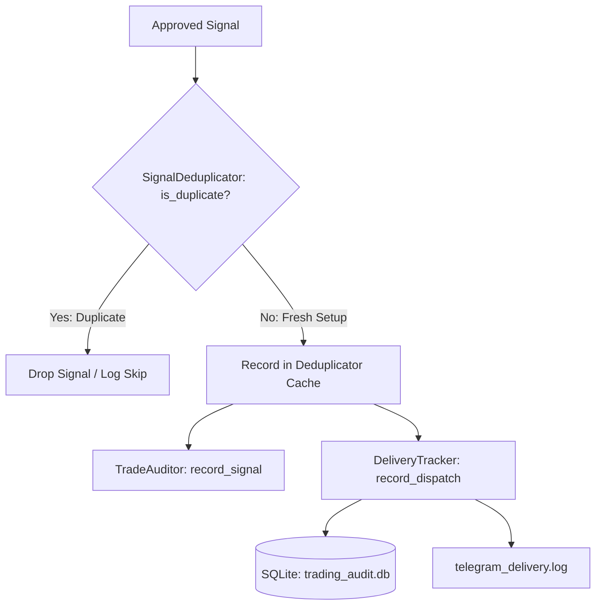

# TxBot Code Index: Audit Module (`txcore/audit`)

> **Module Identifier**: `txcore/audit`  
> **Index Suffix**: `AUDIT`  
> **Source Directory**: [`txcore/audit/`](file:///e:/Txbot/txcore/audit)  
> **Role**: Signal deduplication, cycle telemetry, multi-channel delivery tracking, and SQLite audit persistence (Stage 8: Audit).

---

## 1. Module Overview & Responsibilities

The `txcore.audit` module provides an audit trail for all trading bot activities. It prevents duplicate signal alerts, records execution metrics, tracks external dispatch attempts across chats, and persists delivery statuses to SQLite.

### Key Responsibilities
- **Signal Deduplication**: [`SignalDeduplicator`](file:///e:/Txbot/txcore/audit/deduplicator.py) generates composite keys `(symbol, pattern, candle_time)` and implements 24-hour cache pruning to prevent memory bloat and duplicate alerts.
- **Cycle Telemetry**: [`TradeAuditor`](file:///e:/Txbot/txcore/audit/auditor.py) tracks scan cycles, evaluated symbols, signal conversion rates, and news filter blocks.
- **Delivery & Channel Auditing**: [`DeliveryTracker`](file:///e:/Txbot/txcore/audit/delivery_tracker.py) logs every dispatch attempt per chat ID to [`trading_audit.db`](file:///e:/Txbot/trading_audit.db) and [`telegram_delivery.log`](file:///e:/Txbot/telegram_delivery.log).
- **Safe DB Connection Lifecycle**: Context manager ensures immediate connection closure to avoid Windows SQLite file locking.

---

## 2. File Index & Exported Symbols

| File | Primary Classes | Key Responsibility |
|---|---|---|
| [`deduplicator.py`](file:///e:/Txbot/txcore/audit/deduplicator.py) | `SignalDeduplicator` | In-memory sliding window cache preventing duplicate alerts. |
| [`auditor.py`](file:///e:/Txbot/txcore/audit/auditor.py) | `TradeAuditor` | Scans telemetry, pass/block ratios, and conversion rates. |
| [`delivery_tracker.py`](file:///e:/Txbot/txcore/audit/delivery_tracker.py) | `DeliveryTracker` | Multi-chat SQLite logging (`signal_dispatches` table) and flat file delivery tracking. |
| [`cache.py`](file:///e:/Txbot/txcore/audit/cache.py) | `AuditCache` | In-memory key-value cache with timestamp expiry. |

---

## 3. Class & Method Signatures

### 3.1 [`SignalDeduplicator`](file:///e:/Txbot/txcore/audit/deduplicator.py#L12-L44)
```python
class SignalDeduplicator:
    def __init__(self, max_age_seconds: float = 86400.0): ...
    def make_key(self, symbol: str, pattern: str, candle_time: Any) -> Tuple[str, str, str]: ...
    def is_duplicate(self, symbol: str, pattern: str, candle_time: Any) -> bool: ...
    def record(self, symbol: str, pattern: str, candle_time: Any) -> None: ...
    def prune(self) -> int:
        """Removes entries older than 24h. Returns count of deleted keys."""
```

### 3.2 [`DeliveryTracker`](file:///e:/Txbot/txcore/audit/delivery_tracker.py#L19-L140)
```python
class DeliveryTracker:
    def __init__(self, db_path: Optional[str] = None, log_path: Optional[str] = None): ...

    def record_dispatch(
        self,
        signal_id: str,
        pair: str,
        direction: str,
        pattern: str,
        price: float,
        chat_id: str,
        status: str,              # 'SENT', 'FAILED', 'SKIPPED'
        error_message: Optional[str] = None,
    ) -> int:
        """Records to trading_audit.db and appends to telegram_delivery.log."""

    def get_recent_dispatches(self, limit: int = 50) -> List[Dict[str, Any]]:
        """Queries recent dispatches from SQLite database."""
```

### 3.3 Database Schema: `trading_audit.db`
```sql
CREATE TABLE IF NOT EXISTS signal_dispatches (
    id INTEGER PRIMARY KEY AUTOINCREMENT,
    signal_id TEXT NOT NULL,
    pair TEXT NOT NULL,
    direction TEXT NOT NULL,
    pattern TEXT NOT NULL,
    price REAL NOT NULL,
    chat_id TEXT NOT NULL,
    status TEXT NOT NULL,
    error_message TEXT,
    sent_at_utc TEXT NOT NULL,
    sent_at_local TEXT NOT NULL
);
CREATE INDEX IF NOT EXISTS idx_sig_id ON signal_dispatches(signal_id);
CREATE INDEX IF NOT EXISTS idx_chat_id ON signal_dispatches(chat_id);
```

---

## 4. Audit Data Flow



---

## 5. Token-Saving AI Guide

- Before sending any signal in a loop, verify with `deduplicator.is_duplicate(pair, pattern, candle_time)`.
- If checking past dispatches or troubleshooting Telegram failures, query `DeliveryTracker.get_recent_dispatches()`.
- Use the table and schema definitions above without reading the raw SQLite queries from source.
