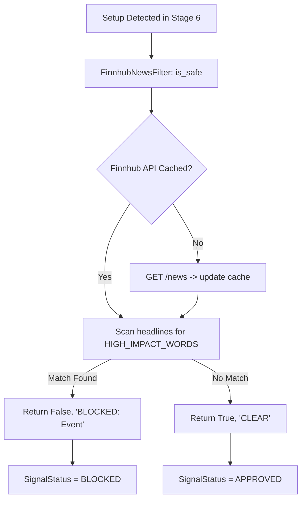

# TxBot Code Index: Filters Module (`txcore/filters`)

> **Module Identifier**: `txcore/filters`  
> **Index Suffix**: `FILTERS`  
> **Source Directory**: [`txcore/filters/`](file:///e:/Txbot/txcore/filters)  
> **Role**: Pre-trade risk, volatility, macroeconomic events, and news safety filters.

---

## 1. Module Overview & Responsibilities

The `txcore.filters` module provides pre-trade risk checks to block or pause signal generation during periods of abnormal market danger (e.g. interest rate announcements, non-farm payrolls, central bank rate speeches).

### Key Responsibilities
- **Abstract Safety Contract**: [`BaseFilter`](file:///e:/Txbot/txcore/filters/base.py) defines the `is_safe(pair, timestamp)` contract.
- **Finnhub News Filter**: [`FinnhubNewsFilter`](file:///e:/Txbot/txcore/filters/news_finnhub.py) scans global macroeconomic headlines for high-impact keywords (`fed`, `rate`, `cpi`, `inflation`, `fomc`, `gdp`).
- **TTL Response Cache**: Caches news headlines for 60 seconds to stay safely within free API rate limits.
- **Fail-Open Strategy**: If API keys are unconfigured or external network is down, returns `(True, "CLEAR (No key)")` so trading is not blocked by external network outages.

---

## 2. File Index & Exported Symbols

| File | Primary Classes | Key Responsibility |
|---|---|---|
| [`base.py`](file:///e:/Txbot/txcore/filters/base.py) | `BaseFilter` | Abstract interface for pre-trade risk filters. |
| [`news_finnhub.py`](file:///e:/Txbot/txcore/filters/news_finnhub.py) | `FinnhubNewsFilter` | Macroeconomic calendar and headline keyword sentiment filter. |

---

## 3. Class & Method Signatures

### 3.1 [`BaseFilter`](file:///e:/Txbot/txcore/filters/base.py) (ABC)
```python
class BaseFilter(ABC):
    @abstractmethod
    def is_safe(self, pair: str, timestamp: Optional[Any] = None) -> Tuple[bool, str]:
        """
        Returns (is_safe: bool, status_reason: str).
        If is_safe is False, the signal is marked BLOCKED.
        """
```

### 3.2 [`FinnhubNewsFilter`](file:///e:/Txbot/txcore/filters/news_finnhub.py#L15-L97)
```python
class FinnhubNewsFilter(BaseFilter):
    HIGH_IMPACT_WORDS = {
        "rate", "interest", "central bank", "fed", "ecb", "boj", "boe",
        "cpi", "inflation", "employment", "payroll", "gdp", "fomc", ...
    }

    def __init__(
        self,
        api_key: str = "",
        lookback_minutes: int = 10,
        cache_ttl_seconds: int = 60,
        pair_currencies: Optional[Dict[str, Set[str]]] = None,
    ): ...

    def is_safe(self, pair: str, timestamp: Optional[Any] = None) -> Tuple[bool, str]:
        """
        Evaluates recent headlines matching the pair's currencies.
        Returns: (True, "CLEAR") or (False, "BLOCKED: <Headline>").
        """
```

---

## 4. Filter Evaluation Pipeline



---

## 5. Token-Saving AI Guide

- Before generating signals, call `is_safe, news_status = news_filter.is_safe(pair)`.
- If news blocks the setup, signal is marked `SignalStatus.BLOCKED` and logged to telemetry without external dispatch.
