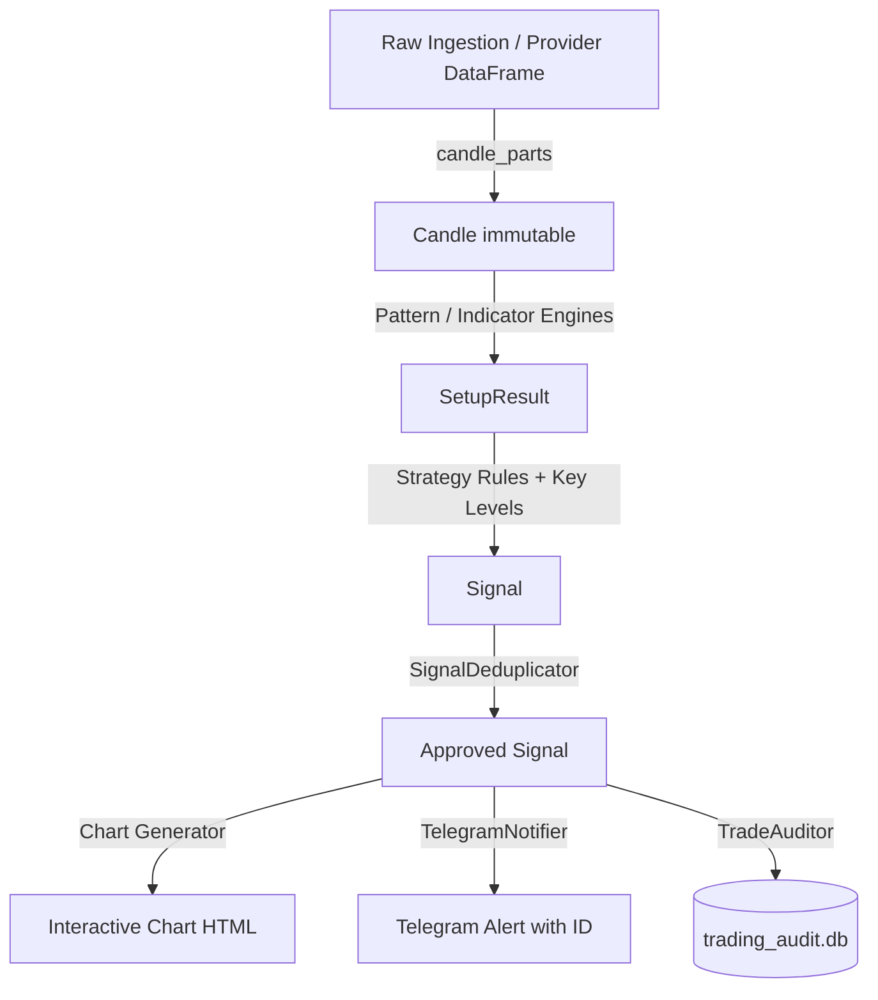

# TxBot Code Index: Models Module (`txcore/models`)

> **Module Identifier**: `txcore/models`  
> **Index Suffix**: `MODELS`  
> **Source Directory**: [`txcore/models/`](file:///e:/Txbot/txcore/models)  
> **Primary File**: [`types.py`](file:///e:/Txbot/txcore/models/types.py)  
> **Role**: Domain models, strong typing, immutable value objects, enums, and data contracts shared across all markets and modules.

---

## 1. Module Overview & Responsibilities

The `txcore.models` module provides the core data structures and domain entities for TxBot. It guarantees **strict market-agnostic typing** across the entire 10-stage pipeline (Forex, Indian Equities/F&O, Commodities, Crypto).

### Key Responsibilities
- **Immutability & Safety**: Frozen dataclasses (`Candle`) prevent accidental state mutation during parallel scans.
- **Unique Signal Tracking**: Cryptographically collision-resistant signal identification format (`SIG-{PAIR}-{YYYYMMDD-HHMMSS}-{RANDOM_HEX_6}`).
- **Cross-Market Normalization**: Standardized index quotes, stock quotes, market breadth, and session states.
- **Volatility Regimes**: Standard India VIX classification categories (`LOW`, `NORMAL`, `ELEVATED`, `EXTREME`).

---

## 2. Symbol & Contract Dictionary

### 2.1 Enums

| Enum Name | Values | Purpose & Market Logic |
|---|---|---|
| [`Direction`](file:///e:/Txbot/txcore/models/types.py#L14-L18) | `CALL`, `PUT`, `NEUTRAL` | Directional trade intent. `CALL` = Bullish/Long, `PUT` = Bearish/Short. |
| [`CandleType`](file:///e:/Txbot/txcore/models/types.py#L20-L34) | `DOJI`, `DRAGONFLY_DOJI`, `GRAVESTONE_DOJI`, `HAMMER`, `INVERTED_HAMMER`, `SHOOTING_STAR`, `SPINNING_TOP`, `MARUBOZU_BULLISH`, `MARUBOZU_BEARISH`, `WEAK_BULLISH`, `WEAK_BEARISH`, `STANDARD_BULLISH`, `STANDARD_BEARISH` | Comprehensive anatomical classification of a single candle based on wick and body ratios. |
| [`PatternType`](file:///e:/Txbot/txcore/models/types.py#L36-L46) | `BULLISH_ENGULFING`, `BEARISH_ENGULFING`, `PIERCING_LINE`, `DARK_CLOUD_COVER`, `MORNING_STAR`, `EVENING_STAR`, `TWEEZER_BOTTOM`, `TWEEZER_TOP`, `CUSTOM` | Multi-candle price action pattern names from the Ishaq Price Action rulebook. |
| [`SignalStatus`](file:///e:/Txbot/txcore/models/types.py#L48-L53) | `PENDING`, `APPROVED`, `BLOCKED`, `REJECTED` | Execution lifecycle state of a generated alert. |
| [`MarketStatus`](file:///e:/Txbot/txcore/models/types.py#L160-L167) | `OPEN`, `CLOSED`, `PRE_OPEN`, `POST_CLOSE`, `WEEKEND`, `HOLIDAY` | Global exchange session state. |
| [`VixRegime`](file:///e:/Txbot/txcore/models/types.py#L169-L174) | `LOW` (<13), `NORMAL` (13-18), `ELEVATED` (18-24), `EXTREME` (>=24) | Volatility regime classification for option pricing and risk controls. |

---

### 2.2 Dataclasses & Value Objects

#### [`Candle`](file:///e:/Txbot/txcore/models/types.py#L56-L92) (Frozen Dataclass)
Represents a single completed or forming OHLCV bar.
- **Attributes**:
  - `time: datetime` — Bar timestamp (UTC/IST).
  - `open: float` — Opening price.
  - `high: float` — High price (guaranteed >= max(open, close)).
  - `low: float` — Low price (guaranteed <= min(open, close)).
  - `close: float` — Closing price.
  - `volume: float = 0.0` — Volume traded.
- **Computed Properties**:
  - `body -> float`: `abs(close - open)`
  - `range -> float`: `max(0.0, high - low)`
  - `upper_wick -> float`: `max(0.0, high - max(open, close))`
  - `lower_wick -> float`: `max(0.0, min(open, close) - low)`
  - `is_bullish -> bool`: `close > open`
  - `is_bearish -> bool`: `close < open`
  - `is_flat -> bool`: `close == open`

#### [`SetupResult`](file:///e:/Txbot/txcore/models/types.py#L110-L119)
Represents an identified pattern setup awaiting confirmation/entry.
- **Attributes**:
  - `direction: Direction` — Direction of setup (`CALL`/`PUT`).
  - `pattern: PatternType` — Identified pattern.
  - `pattern_index: int` — Bar index where pattern completed.
  - `entry_index: int` — Bar index for trigger/entry.
  - `level: float` — Crucial support/resistance anchor level.
  - `reason: str` — Rule description from the price action guide.
  - `metadata: Dict[str, Any]` — Indicator states, EMA values, wick ratios.

#### [`Signal`](file:///e:/Txbot/txcore/models/types.py#L122-L158)
Actionable trade alert with complete lifecycle state and audit identity.
- **Attributes**:
  - `pair: str` — Symbol / Instrument (e.g., `RELIANCE`, `EUR/USD`, `NIFTY`).
  - `direction: Direction` — `CALL` or `PUT`.
  - `pattern: str` — Pattern name.
  - `level: float` — S/R level.
  - `price: float` — Trigger price.
  - `candle_time: datetime` — Bar timestamp.
  - `reason: str` — Strategy rule description.
  - `signal_id: str` — Generated via `generate_signal_id(pair, candle_time)`.
  - `status: SignalStatus` — `APPROVED`, `BLOCKED`, etc.
  - `provider: str` — Data source (`TRADINGVIEW`, `NSE`).
  - `news_status: str` — News filter result (`CLEAR`, `BLOCKED`).
  - `timeframe: str` — Timeframe (`1-Minute`, `5-Minute`, etc.).
  - `metadata: Dict[str, Any]` — Stop loss, target, chart links, indicators.
- **Methods**:
  - `to_alert_message(version_tag) -> str`: Formats alert text with emojis and unique signal ID for Telegram/WhatsApp dispatch.

#### Market Context Dataclasses
- [`IndexQuote`](file:///e:/Txbot/txcore/models/types.py#L177-L210): Snapshot of an index (symbol, last_price, change, percent_change, advances, declines, PE, PB).
- [`StockQuote`](file:///e:/Txbot/txcore/models/types.py#L213-L234): Equity quote (symbol, company_name, last_price, change, volume, 52w high/low).
- [`MarketBreadth`](file:///e:/Txbot/txcore/models/types.py#L237-L275): Advances, declines, unchanged counts, `advance_decline_ratio`, `sentiment` (`STRONGLY_BULLISH` to `STRONGLY_BEARISH`).
- [`MarketSessionInfo`](file:///e:/Txbot/txcore/models/types.py#L278-L291): Session status (`OPEN`/`CLOSED`), trading active flag, countdown minutes to open/close.
- [`VixAnalysis`](file:///e:/Txbot/txcore/models/types.py#L294-L308): Current VIX, regime (`VixRegime`), options buying/selling implication.
- [`OptionChainSummary`](file:///e:/Txbot/txcore/models/types.py#L311-L323): PCR, total Call/Put OI, max pain strike, top OI strikes.

---

### 2.3 Standalone Functions

#### [`generate_signal_id(pair: str, timestamp: Optional[datetime]) -> str`](file:///e:/Txbot/txcore/models/types.py#L97-L106)
- **Generates**: `SIG-{PAIR}-{YYYYMMDD-HHMMSS}-{RANDOM_HEX_6}`
- **Guarantee**: Unique identifier used across deduplication, database audit tables, chart filenames, and Telegram alerts.

---

## 3. Data Flow & Type Interactions

---

## 4. AI Quick-Lookup Matrix

| If You Need To... | Use This Symbol | File & Line |
|---|---|---|
| Create an immutable bar | `Candle(time, open, high, low, close, volume)` | [`types.py#L56`](file:///e:/Txbot/txcore/models/types.py#L56) |
| Check candle direction | `candle.is_bullish` / `candle.is_bearish` | [`types.py#L82-L88`](file:///e:/Txbot/txcore/models/types.py#L82-L88) |
| Create a trade alert | `Signal(pair, direction, pattern, level, price, candle_time, reason)` | [`types.py#L122`](file:///e:/Txbot/txcore/models/types.py#L122) |
| Create a unique ID | `generate_signal_id(pair, timestamp)` | [`types.py#L97`](file:///e:/Txbot/txcore/models/types.py#L97) |
| Check VIX risk regime | `VixRegime(enum)` / `VixAnalysis` | [`types.py#L169`](file:///e:/Txbot/txcore/models/types.py#L169) |
