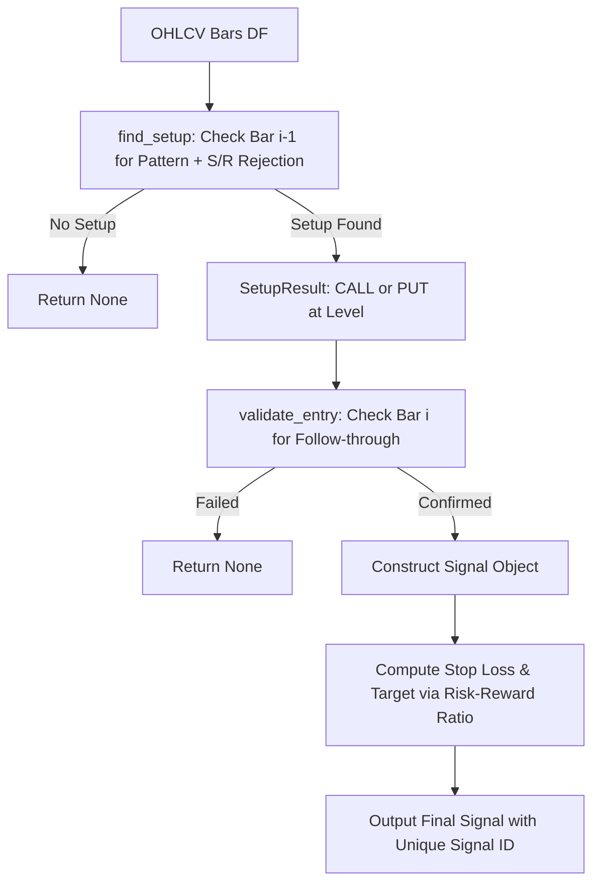

# TxBot Code Index: Strategies Module (`txcore/strategies`)

> **Module Identifier**: `txcore/strategies`  
> **Index Suffix**: `STRATEGIES`  
> **Source Directory**: [`txcore/strategies/`](file:///e:/Txbot/txcore/strategies)  
> **Role**: Strategy decision engines, setup discovery, entry validation, risk-reward calculation, and walk-forward historical evaluation (Stage 7: Execute).

---

## 1. Module Overview & Responsibilities

The `txcore.strategies` module evaluates multi-factor market data to produce deterministic trading signals (`CALL` or `PUT`). It decouples pattern identification from trade execution rules.

### Key Responsibilities
- **Abstract Strategy Contract**: [`BaseStrategy`](file:///e:/Txbot/txcore/strategies/base.py) enforces standard lifecycle (`find_setup` -> `validate_entry` -> `evaluate`).
- **Ishaq Price Action Strategy**: [`PDFPriceActionStrategy`](file:///e:/Txbot/txcore/strategies/pdf_price_action.py) implements the 6 core setups from the price action guide:
  1. Support Retracement + Bullish Engulfing -> CALL
  2. Support Retracement + Piercing Line -> CALL
  3. Support Retracement + Morning Star -> CALL
  4. Resistance Retracement + Bearish Engulfing -> PUT
  5. Resistance Retracement + Dark Cloud Cover -> PUT
  6. Resistance Retracement + Evening Star -> PUT
- **Walk-Forward Evaluation**: [`StrategyEvaluator`](file:///e:/Txbot/txcore/strategies/evaluator.py) provides zero-lookahead backtesting across historical bars and generates win rate, profit factor, and per-trade PnL reports.

---

## 2. File Index & Exported Symbols

| File | Primary Classes | Key Responsibility |
|---|---|---|
| [`base.py`](file:///e:/Txbot/txcore/strategies/base.py) | `BaseStrategy` | Abstract interface for all strategy implementations. |
| [`pdf_price_action.py`](file:///e:/Txbot/txcore/strategies/pdf_price_action.py) | `PDFPriceActionStrategy` | Production rulebook engine with dynamic S/R rejection, 3-candle confirmation, and stop/target levels. |
| [`evaluator.py`](file:///e:/Txbot/txcore/strategies/evaluator.py) | `StrategyEvaluator`, `TradeRecord`, `StrategyEvaluationReport` | Historical backtest simulator with customizable risk-reward ratios and date windows. |

---

## 3. Class & Method Signatures

### 3.1 [`BaseStrategy`](file:///e:/Txbot/txcore/strategies/base.py#L14-L40) (ABC)
```python
class BaseStrategy(ABC):
    @abstractmethod
    def find_setup(self, df: pd.DataFrame) -> Optional[SetupResult]:
        """Scans historical bars for pattern formation and retracement level."""

    @abstractmethod
    def validate_entry(self, df: pd.DataFrame, setup: SetupResult) -> bool:
        """Validates confirmation bar and price action trigger conditions."""

    @abstractmethod
    def evaluate(self, df: pd.DataFrame, symbol: str) -> Optional[Signal]:
        """Runs end-to-end evaluation returning an approved Signal or None."""
```

### 3.2 [`PDFPriceActionStrategy`](file:///e:/Txbot/txcore/strategies/pdf_price_action.py)
Concrete implementation of the Price Action manual.
- **Parameters**:
  - `lookback_bars: int = 20` — Window for dynamic support/resistance calculation.
  - `require_prior_trend: bool = False` — If true, requires prior trend confirmation.
  - `strict_engulf: bool = False` — Enforces strict high/low engulfing.
  - `risk_reward_ratio: float = 1.5` — Multiplier for target profit distance.
- **Methods**:
  - `evaluate(df: pd.DataFrame, symbol: str) -> Optional[Signal]`:
    - Computes `key_levels(df, -2, lookback)`.
    - Detects pattern on bar `len(df) - 2`.
    - Checks level rejection on bar `len(df) - 2`.
    - Confirms entry candle closed on bar `len(df) - 1`.
    - Attaches stop loss (`level` or swing low/high) and target (`price + (price - SL) * R:R`).

### 3.3 [`StrategyEvaluator`](file:///e:/Txbot/txcore/strategies/evaluator.py#L95-L290)
Walk-forward historical backtesting engine.
```python
class StrategyEvaluator:
    def __init__(self, strategy: Optional[BaseStrategy] = None, risk_reward_ratio: float = 1.5):
        ...

    def evaluate(
        self,
        df: pd.DataFrame,
        symbol: str,
        start_date: Optional[str] = None,
        end_date: Optional[str] = None,
        timeframe: str = "5m",
        max_holding_bars: int = 20,
    ) -> StrategyEvaluationReport:
        """
        Walks bar-by-bar from start to end without future lookahead.
        Simulates entries, trails stops, records wins/losses, and returns a StrategyEvaluationReport.
        """
```

---

## 4. Signal Evaluation Workflow



---

## 5. Token-Saving AI Guide

- To evaluate a strategy in live execution, call `strategy.evaluate(df, symbol)`.
- To backtest past performance for any date range, invoke `StrategyEvaluator(strategy).evaluate(df, symbol, start_date, end_date)`.
- Stop Loss is placed at `level` (or pattern extreme); Target is placed at `entry + (entry - SL) * risk_reward_ratio`.
