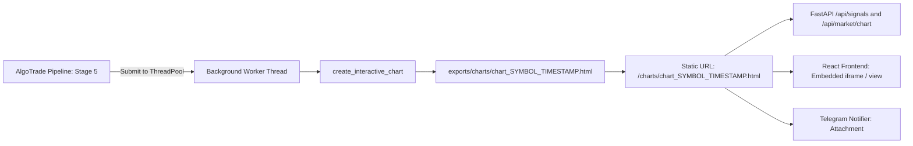

# TxBot Code Index: Visualization Module (`txcore/visualization`)

> **Module Identifier**: `txcore/visualization`  
> **Index Suffix**: `VISUALIZATION`  
> **Source Directory**: [`txcore/visualization/`](file:///e:/Txbot/txcore/visualization)  
> **Role**: Asynchronous, non-blocking chart generation, visual audit rendering, TradingView Lightweight Charts (v4.2.1) standalone HTML generator, and Plotly graphics (Stage 5: Visualization & Stage 8: Audit Charting).

---

## 1. Module Overview & Responsibilities

The `txcore.visualization` module builds interactive charts for both live trading signals and post-trade auditing. Designed with non-blocking concurrency, chart generation jobs run asynchronously in background thread pools (`ThreadPoolExecutor`) so they never block the core signal evaluation loop.

### Key Architectural Traits
- **Dual Engine Architecture**:
  1. `tradingview` (Default): Standalone HTML using TradingView Lightweight Charts (v4.2.1) with HUD cursor inspector, quick zoom presets (10m, 30m, 1h, all), S/R toggles, and pattern audit table.
  2. `plotly`: Pure Python scientific candlestick figure with range slider and annotations.
- **Audit Visualization**: Generates dedicated audit charts capturing the signal bar + preceding lookback + exactly 30 subsequent candles to verify trade follow-through.
- **Artifact Generation**: Outputs timestamped files (`chart_{symbol}_{YYYYMMDD_HHMMSS}.html`) and symlinked/latest files (`latest_{symbol}.html`) in [`exports/charts/`](file:///e:/Txbot/exports/charts).

---

## 2. File Index & Exported Symbols

| File | Primary Functions | Key Responsibility |
|---|---|---|
| [`chart_builder.py`](file:///e:/Txbot/txcore/visualization/chart_builder.py) | `create_interactive_chart`, `scan_df_for_patterns`, `build_tradingview_chart_html`, `build_plotly_chart`, `recreate_tradingview_chart`, `audit_pair_patterns`, `run_test_signal` | Core HTML chart builder, pattern scanning, TradingView v4 template rendering, Plotly generation. |
| [`chart_cli.py`](file:///e:/Txbot/txcore/visualization/chart_cli.py) | `main` | Standalone CLI utility to render and preview interactive charts for any symbol or timeframe. |

---

## 3. Function Signatures & Parameters

### 3.1 [`create_interactive_chart(...) -> str`](file:///e:/Txbot/txcore/visualization/chart_builder.py#L924-L993)
Primary entry point for rendering an interactive candlestick chart to disk.
```python
def create_interactive_chart(
    df: pd.DataFrame,
    symbol: str,
    signal: Optional[Signal] = None,
    setup: Optional[SetupResult] = None,
    support_level: Optional[float] = None,
    resistance_level: Optional[float] = None,
    output_dir: Optional[str] = None,          # Defaults to exports/charts/
    lookback_bars: int = 180,
    engine: str = "tradingview",               # "tradingview" or "plotly"
    setups: Optional[List[Dict[str, Any]]] = None,
    auto_open: bool = False,
) -> str:
    """
    Renders an interactive HTML candlestick chart and saves it into exports/charts/.
    Generates chart_{symbol}_{timestamp}.html and updates latest_{symbol}.html.
    Returns the absolute filepath to the created HTML chart.
    """
```

### 3.2 [`scan_df_for_patterns(df: pd.DataFrame) -> List[Dict[str, Any]]`](file:///e:/Txbot/txcore/visualization/chart_builder.py#L33-L93)
Scans historical bars in a DataFrame and generates a list of pattern setup metadata dictionaries for table rendering and chart marker overlays.

### 3.3 [`build_tradingview_chart_html(...) -> str`](file:///e:/Txbot/txcore/visualization/chart_builder.py#L95-L831)
Constructs the complete standalone HTML string with bundled CSS, JavaScript, embedded TradingView Lightweight Charts library script, crosshair HUD, and responsive tables.

---

## 4. Concurrency & Chart Lifecycle



---

## 5. Token-Saving AI Guide

- Calling `create_interactive_chart(df, symbol=symbol)` returns the absolute file path to the generated HTML file.
- The charts directory is mounted on the backend service at `http://localhost:8000/charts/{filename}`.
- To inspect chart generation logic, consult this index; you do not need to parse the 1,130 lines of embedded HTML/JS inside `chart_builder.py`.
