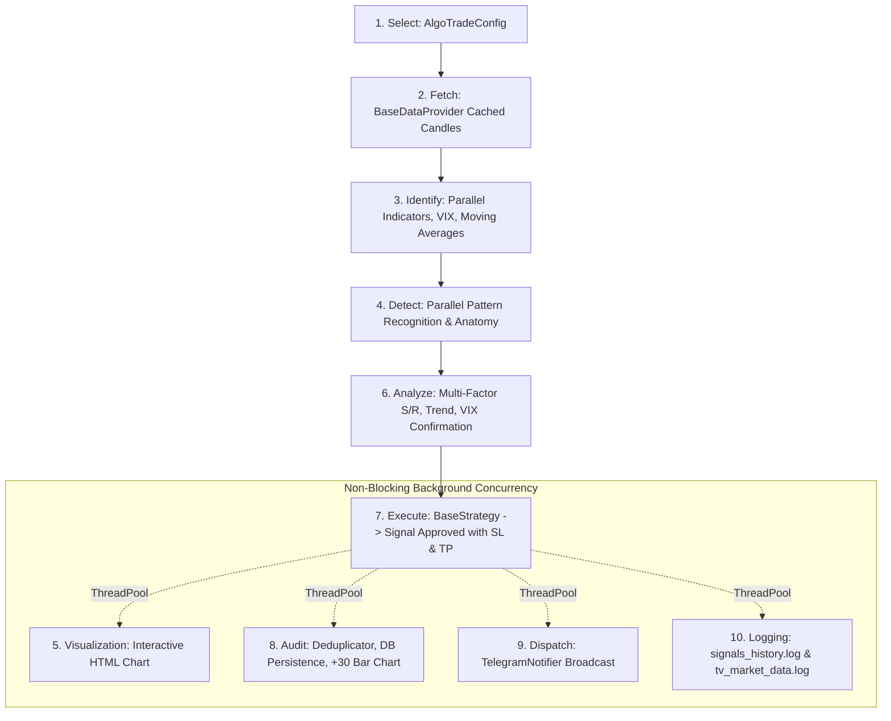

# TxBot Code Index: AlgoTrade Pipeline & Orchestration (`txcore/algotrade`)

> **Module Identifier**: `txcore/algotrade`  
> **Index Suffix**: `ALGOTRADE`  
> **Source File**: [`txcore/algotrade.py`](file:///e:/Txbot/txcore/algotrade.py)  
> **Role**: Universal 10-Stage Market-Agnostic Trading Pipeline and AlgoTrade Process Model Engine.

---

## 1. Module Overview & Responsibilities

The `txcore.algotrade` module is the central engine of the TxBot platform. It implements the universal 10-stage trading pipeline, allowing users to configure, name, run, and monitor independent trading strategy processes (called **AlgoTrade** instances) across any market without code changes.

### Key Architectural Traits
- **Market-Agnostic Engine**: Uses injectable providers, strategies, and notifiers so the same engine powers Indian Equities/F&O, Forex, Crypto, or Commodities.
- **Strict 10-Stage Universal Pipeline**:
  1. **Select**: Configuration loading (`AlgoTradeConfig`).
  2. **Fetch**: Thread-safe TTL cached data ingestion (`BaseDataProvider`).
  3. **Identify**: Async extraction of candles, VIX, moving averages, VWAP, and indicators.
  4. **Detect**: Parallel pattern recognition and anatomy classification.
  5. **Visualization**: Background parallel thread-pool chart rendering (TradingView Lightweight Charts v4.2.1).
  6. **Analyze**: Multi-factor trend, volatility regime, and support/resistance validation.
  7. **Execute**: Strategy decision (`BaseStrategy.evaluate`) producing approved `Signal`.
  8. **Audit**: Deduplication, cycle metrics, SQLite delivery logging, +30 candle audit charts.
  9. **Dispatch**: Non-blocking asynchronous dispatch (Telegram, webhooks, console).
  10. **Logging**: Footprint append to `signals_history.log` and `tv_market_data.log`.
- **Parallel Multi-Symbol Batch Scanning**: `ThreadPoolExecutor` scans dozens of symbols simultaneously with zero loop blocking.

---

## 2. Symbol & Contract Dictionary

### 2.1 Enums & Config Dataclass

#### [`AlgoTradeStatus`](file:///e:/Txbot/txcore/algotrade.py#L56-L62) (Enum)
- `IDLE`: Registered, awaiting first trigger or schedule time.
- `RUNNING`: Actively running continuous scans.
- `PAUSED`: Temporarily paused; auto-scheduler will not trigger scans.
- `STOPPED`: Halted manually or by schedule.
- `ERROR`: Process halted due to unhandled pipeline failure.

#### [`AlgoTradeConfig`](file:///e:/Txbot/txcore/algotrade.py#L65-L106) (Dataclass)
Defines Stage 1 (Select). Auto-generates collision-resistant IDs: `AT-{NAME}-{YYYYMMDD}-{HEX6}`.
- `algo_name: str` — User-defined label (e.g. "Ishaq Strategy 1", "Nifty Scalper").
- `market: str = "INDIAN_EQUITY"` — Target market (`INDIAN_EQUITY`, `FOREX`, `CRYPTO`).
- `timeframe: str = "5m"` — Execution timeframe (`1m`, `5m`, `15m`, `1h`, `1d`).
- `symbols: List[str]` — Monitored symbols (e.g. `["RELIANCE", "TCS"]` or `["EUR/USD"]`).
- `indices: List[str]` — Benchmark indices for market context (e.g. `["NIFTY 50"]`).
- `data_provider: str = "tradingview"` — Provider ID (`tradingview`, `indian_provider`).
- `strategy: str = "pdf_price_action"` — Strategy ID.
- `indicators: List[str]` — Selected indicators (`["EMA_20", "EMA_50", "RSI"]`).
- `patterns: List[str]` — Selected patterns (`["bullish_engulfing", "piercing_line"]`).
- `chart_enabled: bool = True` — Toggles automatic HTML chart generation.
- `audit_enabled: bool = True` — Toggles database and telemetry auditing.
- `risk_reward_ratio: float = 1.5` — Risk-to-reward ratio for stop loss/target calculation.
- `enable_mtf: bool = False` — Multi-Timeframe Confirmation filter against macro trend.
- `higher_timeframe: str = "15m"` — Higher timeframe for MTF trend evaluation.
- `strict_mtf: bool = False` — Requires strict trend alignment if True.
- `use_atr_risk: bool = True` — Dynamic volatility-based Stop Loss & Target via Average True Range (ATR).
- `atr_period: int = 14` — Rolling period for ATR calculation.
- `atr_multiplier: float = 1.5` — Multiplier for ATR risk distance.
- `start_date / end_date: Optional[str]` — Date range for historical backtests.
- `start_time / stop_time: Optional[str]` — Auto-schedule times (e.g. `"09:15:00"`, `"15:30:00"`).
- `creator: str = "Admin"` — Strategy author.
- `max_workers: int = 8` — Parallel threads for symbol scanning.

---

### 2.2 Core Classes

#### [`AlgoTrade`](file:///e:/Txbot/txcore/algotrade.py#L108-L585)
A single running instance of the 10-stage universal pipeline.
- **Methods**:
  - `run_cycle() -> List[Dict[str, Any]]`: Scans all configured symbols in parallel using thread pool; broadcasts `cycle_update` via SSE.
  - `execute_pipeline(symbol: str) -> Optional[Dict[str, Any]]`: End-to-end execution of Stages 1 to 10 for a single instrument with microsecond latency recording.
  - `get_concurrency_stats() -> Dict[str, Any]`: Transparent telemetry on active worker threads, queue depth, last cycle ms, and per-symbol scan latencies.
  - `evaluate_historical(symbol, start_date, end_date) -> StrategyEvaluationReport`: Historical walk-forward backtest.
  - `get_metrics() -> Dict[str, Any]`: Aggregates win rate %, total PnL %, cycle counts, active signal records, and concurrency telemetry.
  - `close()`: Clean shutdown of internal thread pool.

#### [`AlgoTradeManager`](file:///e:/Txbot/txcore/algotrade.py#L586-L750)
Central registry and lifecycle coordinator for all AlgoTrade instances.
- **Methods**:
  - `register_algo(config, provider, strategy, notifiers) -> AlgoTrade`: Creates and registers a new instance.
  - `get_algo(algo_id: str) -> Optional[AlgoTrade]`: Finds instance by ID.
  - `get_algo_by_name(name: str) -> Optional[AlgoTrade]`: Finds instance by human name.
  - `list_algos(include_deleted: bool = False) -> List[Dict[str, Any]]`: Lists all instances with live metrics.
  - `start_algo(algo_id) / stop_algo(algo_id) / pause_algo(algo_id) -> bool`: State transitions.
  - `copy_algo(algo_id: str) -> Optional[AlgoTrade]`: Duplicates configuration under a fresh ID.
  - `delete_algo(algo_id: str, hard: bool = False) -> bool`: Soft-deletes or removes from memory.
  - `run_all_cycles() -> Dict[str, Any]`: Triggers a parallel scan cycle across all active RUNNING instances.
  - `get_concurrency_overview() -> Dict[str, Any]`: Consolidated telemetry across all managed algos for real-time streaming and monitoring.
  - `get_all_signals(algo_id) / get_signal_by_id(signal_id)`: Queries aggregated signals across all strategies.
  - `get_all_pnl(algo_id) -> Dict[str, Any]`: Aggregates consolidated portfolio PnL.

---

## 3. The 10-Stage Universal Pipeline Architecture

---

## 4. Token-Saving AI Guide

- Access the global singleton manager in [`txcore.service`](file:///e:/Txbot/txcore/service.py) via `from txcore.service import manager`.
- To create a strategy programmatically, create `AlgoTradeConfig(...)` and pass it to `manager.register_algo(config)`.
- Use `algo.get_metrics()` to get a complete snapshot of performance, win rate, and signals without querying raw logs.
