# TxBot Code Index: Backend Core Repository (`txcore`)

> **Repository Identifier**: `txcore` (Backend)  
> **Index Suffix**: `TXCORE` / `BACKEND`  
> **Source Directory**: [`txcore/`](file:///e:/Txbot/txcore)  
> **Role**: Universal 10-Stage Market-Agnostic Quantitative Trading Engine, Analysis Libraries, REST Backend Services, and Data Providers.

---

## 1. Backend Architecture & High-Performance Design

The `txcore` package forms the complete backend of TxBot. It is architected strictly under the **Market-Agnostic Pipeline** philosophy: every algorithm, data model, indicator, strategy, visualization, and audit workflow works identically across all asset classes (Forex, Indian Equities/F&O, Commodities, Crypto).

### Architecture Highlights
- **Universal 10-Stage Pipeline**: Select -> Fetch -> Identify -> Detect -> Visualization -> Analyze -> Execute -> Audit -> Dispatch -> Logging.
- **Process Model (AlgoTrade)**: Users can define, name, configure, and monitor multiple isolated strategies concurrently (e.g. "Ishaq Strategy 1", "Nifty Scalper").
- **High Concurrency & Low Latency**:
  - Thread-safe in-memory caching with TTL across all data providers.
  - Asynchronous background thread pools (`ThreadPoolExecutor`) for chart visualization, SQLite auditing, file logging, and Telegram dispatches.
  - Zero-blocking design ensures the main scanning and signal evaluation loops are never delayed by I/O.

---

## 2. Backend Module Map & Sub-Indexes

Every backend module possesses a dedicated deep index file created with the module suffix:

| Backend Module | Sub-Index File | Purpose & Responsibilities |
|---|---|---|
| [`txcore/models`](file:///e:/Txbot/txcore/models) | [`txcore/models/CODE_INDEX_MODELS.md`](file:///e:/Txbot/txcore/models/CODE_INDEX_MODELS.md) | Domain models, frozen `Candle` dataclass, `Signal`, `Direction`, `VixRegime`, `generate_signal_id`. |
| [`txcore/analysis`](file:///e:/Txbot/txcore/analysis) | [`txcore/analysis/CODE_INDEX_ANALYSIS.md`](file:///e:/Txbot/txcore/analysis/CODE_INDEX_ANALYSIS.md) | Single-candle geometry, multi-candle pattern algorithms, dynamic S/R levels, indicators, VIX regimes. |
| [`txcore/providers`](file:///e:/Txbot/txcore/providers) | [`txcore/providers/CODE_INDEX_PROVIDERS.md`](file:///e:/Txbot/txcore/providers/CODE_INDEX_PROVIDERS.md) | `BaseDataProvider` with TTL caching, `TradingViewProvider`, `NSEClient`, `MarketSessionManager`. |
| [`txcore/strategies`](file:///e:/Txbot/txcore/strategies) | [`txcore/strategies/CODE_INDEX_STRATEGIES.md`](file:///e:/Txbot/txcore/strategies/CODE_INDEX_STRATEGIES.md) | `BaseStrategy`, `PDFPriceActionStrategy` (6 core setups), `StrategyEvaluator` historical backtest engine. |
| [`txcore/visualization`](file:///e:/Txbot/txcore/visualization) | [`txcore/visualization/CODE_INDEX_VISUALIZATION.md`](file:///e:/Txbot/txcore/visualization/CODE_INDEX_VISUALIZATION.md) | Interactive HTML charting engine (TradingView Lightweight Charts v4.2.1 & Plotly) and +30 bar audit charts. |
| [`txcore/audit`](file:///e:/Txbot/txcore/audit) | [`txcore/audit/CODE_INDEX_AUDIT.md`](file:///e:/Txbot/txcore/audit/CODE_INDEX_AUDIT.md) | `SignalDeduplicator` (24h prune), `TradeAuditor` telemetry, `DeliveryTracker` with SQLite persistence. |
| [`txcore/execution`](file:///e:/Txbot/txcore/execution) | [`txcore/execution/CODE_INDEX_EXECUTION.md`](file:///e:/Txbot/txcore/execution/CODE_INDEX_EXECUTION.md) | `BaseNotifier`, `TelegramNotifier` (multi-chat support with chart files), non-blocking file loggers. |
| [`txcore/filters`](file:///e:/Txbot/txcore/filters) | [`txcore/filters/CODE_INDEX_FILTERS.md`](file:///e:/Txbot/txcore/filters/CODE_INDEX_FILTERS.md) | `BaseFilter`, `FinnhubNewsFilter` macroeconomic keyword safety guard. |
| **Pipeline Engine** | [`txcore/CODE_INDEX_ALGOTRADE.md`](file:///e:/Txbot/txcore/CODE_INDEX_ALGOTRADE.md) | The 10-stage universal execution engine (`AlgoTrade`) and multi-strategy coordinator (`AlgoTradeManager`). |
| **Services Layer** | [`txcore/CODE_INDEX_SERVICES.md`](file:///e:/Txbot/txcore/CODE_INDEX_SERVICES.md) | FastAPI REST service, background auto-scheduler, and system telemetry endpoints. |
| **Database & ORM** | [`txcore/database.py`](file:///e:/Txbot/txcore/database.py) | Prisma ORM async client (`from prisma import Prisma`), connection lifecycle, and market catalog seeding. |
| **Config Module** | [`config/CODE_INDEX_CONFIG.md`](file:///e:/Txbot/config/CODE_INDEX_CONFIG.md) | Master environment settings, API keys, Indian market exchange timing, and asset watchlists. |

---

## 3. End-to-End Execution Sequence

```mermaid
sequenceDiagram
    autonumber
    actor Trader as User / API / Scheduler
    participant Svc as FastAPI Service (service.py)
    participant Mgr as AlgoTradeManager
    participant AT as AlgoTrade Instance (algotrade.py)
    participant Prov as Data Provider (TradingView / NSE)
    participant Strat as PDFPriceActionStrategy
    participant Viz as ThreadPool: ChartBuilder
    participant Audit as ThreadPool: Auditor / DB
    participant Exec as ThreadPool: TelegramNotifier

    Trader->>Svc: POST /api/algos/{id}/start
    Svc->>Mgr: start_algo(id)
    Mgr->>AT: run_cycle()
    
    rect rgb(20, 24, 38)
        note over AT,Prov: Stage 2: Ingestion & Identification
        AT->>Prov: get_cached_candles(symbol, timeframe, lookback)
        Prov-->>AT: Normalized OHLCV DataFrame
        AT->>AT: Vectorized Indicators & S/R Extraction
    end

    rect rgb(30, 25, 45)
        note over AT,Strat: Stage 4, 6, 7: Pattern Recognition & Strategy
        AT->>Strat: evaluate(df, symbol)
        Strat-->>AT: Actionable Signal (CALL/PUT with SL & Target)
    end

    rect rgb(15, 30, 25)
        note over AT,Exec: Stages 5, 8, 9, 10: Non-Blocking Background Concurrency
        par Async Visualization
            AT->>Viz: generate interactive chart HTML
            Viz-->>AT: saved to exports/charts/
        and Async Auditing & DB
            AT->>Audit: deduplicate & record to trading_audit.db
        and Async Dispatch
            AT->>Exec: send alert text & chart to Telegram chat IDs
        and Async Footprint Logging
            AT->>AT: append to signals_history.log & tv_market_data.log
        end
    end

    AT-->>Mgr: Cycle complete metrics
    Mgr-->>Svc: Cycle results
    Svc-->>Trader: JSON Response {success: True, metrics: ...}
```

---

## 4. Key Standalone Executables

- [`run_server.py`](file:///e:/Txbot/run_server.py): Launches FastAPI backend on `http://0.0.0.0:8000`.
- [`run_algotrade.py`](file:///e:/Txbot/run_algotrade.py): Headless CLI loop running scheduled scan cycles.
- [`txcore/cli.py`](file:///e:/Txbot/txcore/cli.py): Interactive command line interface with ANSI color menus.
- [`test_telegram.py`](file:///e:/Txbot/test_telegram.py): Dispatches sample alert with chart to verify Telegram Bot tokens and chat connectivity.

---

## 5. Token-Saving AI Guide

- Before modifying any backend file, review its corresponding module sub-index above to see complete classes, signatures, and contracts.
- **DO NOT** read all python files under `txcore/` when diagnosing a problem; start with the specific module sub-index to conserve 80-90% of token usage.
- All modules export their primary members in [`txcore/__init__.py`](file:///e:/Txbot/txcore/__init__.py).
