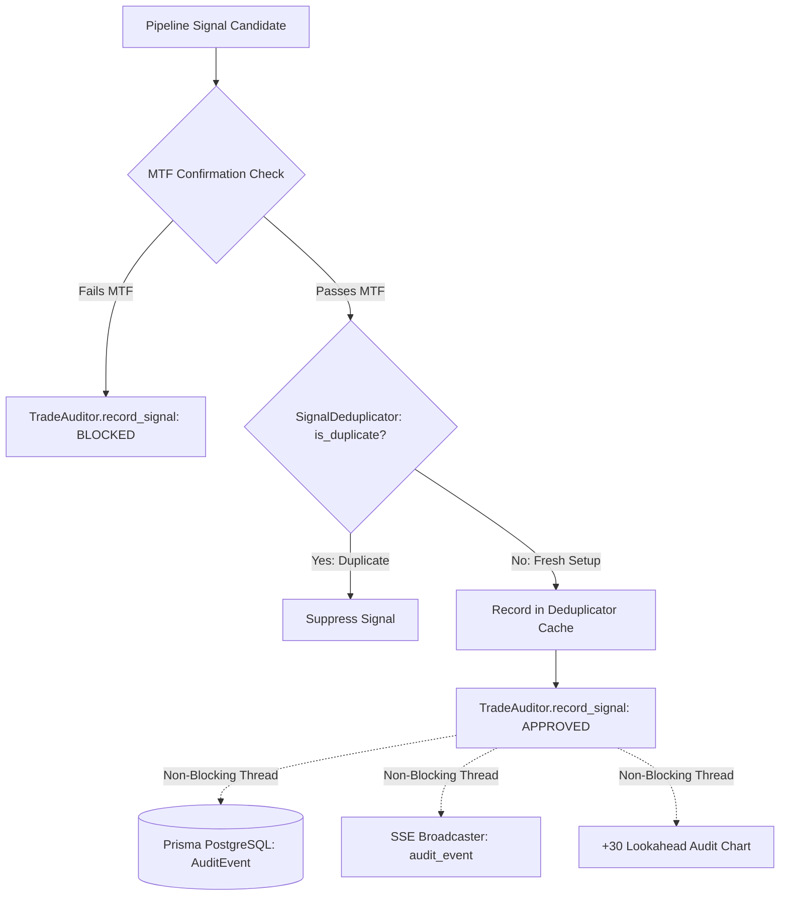

# TxBot Code Index: Audit Module (`txcore/audit`)

> **Module Identifier**: `txcore/audit`  
> **Index Suffix**: `AUDIT`  
> **Source Directory**: [`txcore/audit/`](file:///e:/Txbot/txcore/audit)  
> **Role**: Signal deduplication, cycle telemetry, indicator/level snapshots, filter compliance tracking, and Prisma PostgreSQL audit persistence (Stage 8: Audit).

---

## 1. Module Overview & Responsibilities

The `txcore.audit` module provides an institutional audit trail for all trading bot activities. It prevents duplicate signal alerts, records deep indicator and dynamic level snapshots, tracks rulebook compliance (MTF confirmation, volatility, news), dispatches non-blocking persistence to Prisma PostgreSQL (`AuditEvent` model), and broadcasts live telemetry over Server-Sent Events (SSE).

### Key Responsibilities
- **Signal Deduplication**: [`SignalDeduplicator`](file:///e:/Txbot/txcore/audit/deduplicator.py) generates composite keys `(symbol, pattern, candle_time)` and implements 24-hour cache pruning to prevent memory bloat and duplicate alerts.
- **Deep Institutional Telemetry**: [`TradeAuditor`](file:///e:/Txbot/txcore/audit/auditor.py) captures:
  - Exact Indicator Snapshots (RSI, EMA 20, EMA 50, VWAP, India VIX regime, PCR)
  - Dynamic Support/Resistance & ATR Risk Brackets (Entry, S/R levels, Stop Loss, Target)
  - Filter Blocks (MTF macro trend confirmation, news blocks, risk/reward constraints)
  - Microsecond execution latency metrics per symbol scan
- **Prisma PostgreSQL Persistence**: Asynchronously persists events to `AuditEvent` table via [`txcore.persistence`](file:///e:/Txbot/txcore/persistence.py) without blocking core trading cycles.
- **Real-Time Streaming**: Broadcasts `audit_event` payloads to frontend subscribers via [`TelemetryBroadcaster`](file:///e:/Txbot/txcore/stream.py).
- **Delivery & Channel Auditing**: [`DeliveryTracker`](file:///e:/Txbot/txcore/audit/delivery_tracker.py) logs every dispatch attempt per chat ID to [`trading_audit.db`](file:///e:/Txbot/trading_audit.db) and [`telegram_delivery.log`](file:///e:/Txbot/telegram_delivery.log).

---

## 2. File Index & Exported Symbols

| File | Primary Classes | Key Responsibility |
|---|---|---|
| [`deduplicator.py`](file:///e:/Txbot/txcore/audit/deduplicator.py) | `SignalDeduplicator` | In-memory sliding window cache preventing duplicate alerts. |
| [`auditor.py`](file:///e:/Txbot/txcore/audit/auditor.py) | `TradeAuditor` | Captures indicators, levels, latency, filter rejections, and DB persistence. |
| [`delivery_tracker.py`](file:///e:/Txbot/txcore/audit/delivery_tracker.py) | `DeliveryTracker` | Multi-chat SQLite logging (`signal_dispatches` table) and flat file delivery tracking. |
| [`cache.py`](file:///e:/Txbot/txcore/audit/cache.py) | `AuditCache` | In-memory key-value cache with timestamp expiry. |

---

## 3. Class & Method Signatures

### 3.1 [`SignalDeduplicator`](file:///e:/Txbot/txcore/audit/deduplicator.py#L12-L44)
```python
class SignalDeduplicator:
    def __init__(self, max_age_seconds: float = 86400.0): ...
    def make_key(self, symbol: str, pattern: str, candle_time: Any) -> Tuple[str, str, str]: ...
    def is_duplicate(self, symbol: str, pattern: str, candle_time: Any) -> bool: ...
    def record(self, symbol: str, pattern: str, candle_time: Any) -> None: ...
    def prune(self) -> int:
        """Removes entries older than 24h. Returns count of deleted keys."""
```

### 3.2 [`TradeAuditor`](file:///e:/Txbot/txcore/audit/auditor.py)
```python
class TradeAuditor:
    def __init__(self, algo_id: str = ""): ...

    def record_signal(
        self,
        symbol: str,
        direction: str,
        pattern: str,
        status: str,              # 'APPROVED', 'BLOCKED'
        reason: str = "",
        algo_id: Optional[str] = None,
        indicator_snapshot: Optional[Dict[str, Any]] = None,
        level_snapshot: Optional[Dict[str, Any]] = None,
        latency_ms: int = 0,
        chart_path: Optional[str] = None,
        audit_chart_path: Optional[str] = None,
    ) -> None:
        """Records event into memory history, dispatches non-blocking DB write, and streams via SSE."""

    def record_filter_block(
        self,
        symbol: str,
        filter_name: str,
        reason: str,
        direction: str = "NEUTRAL",
        pattern: str = "N/A",
        indicator_snapshot: Optional[Dict[str, Any]] = None,
        level_snapshot: Optional[Dict[str, Any]] = None,
        latency_ms: int = 0,
    ) -> None: ...

    def get_events(self, status: Optional[str] = None, limit: int = 100) -> List[Dict[str, Any]]: ...
    def get_summary(self) -> Dict[str, Any]:
        """Returns approval rates, filter blocks (MTF, news, risk), and average latencies."""
```

### 3.3 Database Models: `AuditEvent` & `StructuredLog` (Prisma ORM)
```prisma
model AuditEvent {
  id                String    @id @default(uuid())
  algoTradeId       String    @map("algo_trade_id")
  algoTrade         AlgoTrade @relation(fields: [algoTradeId], references: [id], onDelete: Cascade)
  symbol            String
  eventType         String    @map("event_type")
  indicatorSnapshot Json      @map("indicator_snapshot")
  levelSnapshot     Json      @map("level_snapshot")
  decisionReason    String    @map("decision_reason")
  latencyMs         Int       @default(0) @map("latency_ms")
  createdAt         DateTime  @default(now()) @map("created_at")
}
```

---

## 4. Audit Data Flow



---

## 5. Token-Saving AI Guide

- Access audit events via `algo.auditor.get_events()` or query PostgreSQL via `get_audit_events_from_db(algo_id=...)`.
- Filter blocks are tracked separately under `signals_blocked_by_mtf`, `signals_blocked_by_news`, and `signals_blocked_by_risk`.
- Use `algo.auditor.get_summary()` to inspect approval ratios and average execution latency.
