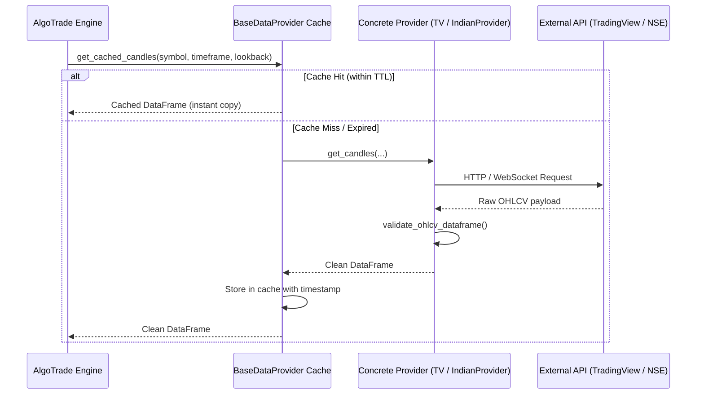

# TxBot Code Index: Providers Module (`txcore/providers`)

> **Module Identifier**: `txcore/providers`  
> **Index Suffix**: `PROVIDERS`  
> **Source Directory**: [`txcore/providers/`](file:///e:/Txbot/txcore/providers)  
> **Role**: Abstract data contracts, live/historical market data ingestion, session timing, cookie management, and thread-safe TTL caching (Stage 2: Fetch).

---

## 1. Module Overview & Responsibilities

The `txcore.providers` module abstracts all external financial data sources behind a unified interface (`BaseDataProvider`). Any market (Forex, Indian Equities/F&O, Crypto, Commodities) is consumed identically by the trading engine.

### Key Responsibilities
- **Unified Market Ingestion**: Abstract base class ensures consistent output schema (`time`, `open`, `high`, `low`, `close`, `volume`).
- **High-Performance Caching**: Built-in thread-safe TTL cache (`get_cached_candles`) eliminates redundant network requests during multi-symbol parallel cycles.
- **Indian Market Specialized Engine**: `NSEClient` handles session cookies, user-agent rotation, real-time option chains, advances/declines, and India VIX.
- **Session Awareness**: `MarketSessionManager` tracks exchange trading hours, lunch breaks, pre-open sessions, and market holidays.

---

## 2. File Index & Exported Symbols

| File | Primary Classes & Functions | Key Responsibility |
|---|---|---|
| [`base.py`](file:///e:/Txbot/txcore/providers/base.py) | `BaseDataProvider`, `STANDARD_OHLCV_COLUMNS`, `validate_ohlcv_dataframe` | Abstract provider interface with thread-safe caching and validation. |
| [`tradingview.py`](file:///e:/Txbot/txcore/providers/tradingview.py) | `TradingViewProvider` | Ingests Forex and multi-asset candlestick data using TradingView feeds. |
| [`nse_provider.py`](file:///e:/Txbot/txcore/providers/nse_provider.py) | `NSEClient` | High-resilience direct scraper for NSE India live quotes, indices, option chains, and breadth. |
| [`indian_provider.py`](file:///e:/Txbot/txcore/providers/indian_provider.py) | `IndianMarketDataProvider` | Concrete adapter inheriting `BaseDataProvider` that routes Indian assets between NSE and TV with real-time active candle synthesis. |
| [`synthesizer.py`](file:///e:/Txbot/txcore/providers/synthesizer.py) | `RealTimeTickSynthesizer`, `parse_timeframe_seconds`, `align_timestamp_to_timeframe` | Universal real-time tick synthesizer dynamically forming the active candle (index -1) in memory. |
| [`session_manager.py`](file:///e:/Txbot/txcore/providers/session_manager.py) | `MarketSessionManager`, `IndianMarketSessionManager`, `create_indian_session_manager` | Real-time exchange calendar, IST market hours (09:15-15:30), holiday validation. |

---

## 3. Class & Method Signatures

### 3.1 [`BaseDataProvider`](file:///e:/Txbot/txcore/providers/base.py#L16-L164) (ABC)
```python
class BaseDataProvider(ABC):
    def __init__(self, cache_ttl_seconds: float = 3.0):
        """Initializes thread-safe in-memory candle cache."""

    @abstractmethod
    def get_candles(
        self, symbol: str, timeframe: str = "1m", lookback_bars: int = 180,
        start_date: Optional[Any] = None, end_date: Optional[Any] = None, **kwargs
    ) -> Optional[pd.DataFrame]:
        """Subclass implementation to fetch raw bars."""

    def get_cached_candles(
        self, symbol: str, timeframe: str = "1m", lookback_bars: int = 180,
        start_date: Optional[Any] = None, end_date: Optional[Any] = None, **kwargs
    ) -> Optional[pd.DataFrame]:
        """Thread-safe TTL cached retrieval. Clones DataFrame to prevent caller mutations."""

    def invalidate_cache(self, symbol: Optional[str] = None) -> None:
        """Invalidates cache for a specific symbol or globally."""
```

### 3.2 [`NSEClient`](file:///e:/Txbot/txcore/providers/nse_provider.py)
Direct client for NSE India website endpoints with automatic cookie refresh.
- `get_stock_quote(symbol: str) -> Optional[StockQuote]`: Fetches official real-time stock quote from `/api/quote-equity` or index fallback.
- `get_index_quote(index_name: str) -> Optional[IndexQuote]`: Fetches index level, change, PE, advances, declines.
- `get_vix_quote() -> Optional[IndexQuote]`: Fetches India VIX live reading.
- `get_market_breadth(index_name: str = "NIFTY 50") -> MarketBreadth`: Calculates ADR and market sentiment.
- `get_option_chain_summary(symbol: str) -> Optional[OptionChainSummary]`: Analyzes PCR, sentiment, and key OI strikes.

### 3.3 [`RealTimeTickSynthesizer`](file:///e:/Txbot/txcore/providers/synthesizer.py)
Market-agnostic synthesizer that updates the active candle (`index -1`) with real-time spot quotes.
- `synthesize_active_candle(df, quote, timeframe="5m", current_time=None) -> Optional[pd.DataFrame]`: Merges live tick into existing bar or appends a new bar upon timeframe interval expiry.
- `get_forming_candle_summary(df: pd.DataFrame) -> Dict[str, Any]`: Diagnostic metrics of candle at `index -1`.


### 3.3 [`MarketSessionManager`](file:///e:/Txbot/txcore/providers/session_manager.py)
Market calendar and operational timing controller.
- `get_session_info() -> MarketSessionInfo`: Returns current `MarketStatus` (`OPEN`, `CLOSED`, `PRE_OPEN`), minutes to open/close.
- `is_market_open() -> bool`: Returns `True` if live market orders are currently permitted.
- `get_current_time() -> datetime`: Returns localized IST datetime.

---

## 4. Ingestion Workflow



---

## 5. Token-Saving AI Guide

- To fetch candles in any pipeline stage, call `provider.get_cached_candles(symbol, timeframe=timeframe, lookback_bars=lookback)`.
- **DO NOT** query external endpoints directly; use `TradingViewProvider` or `IndianMarketDataProvider`.
- All DataFrames returned are normalized to: `['time', 'open', 'high', 'low', 'close', 'volume']` with timezone-aware `time`.
